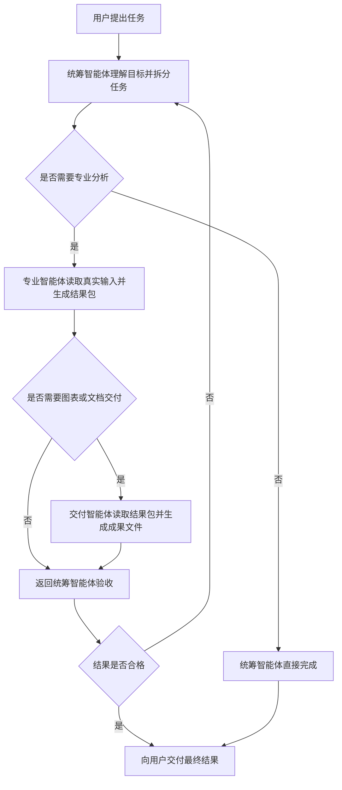
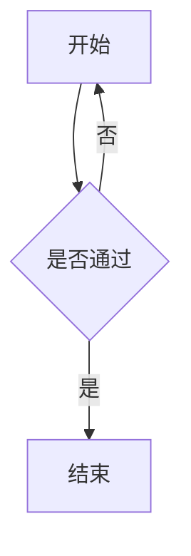
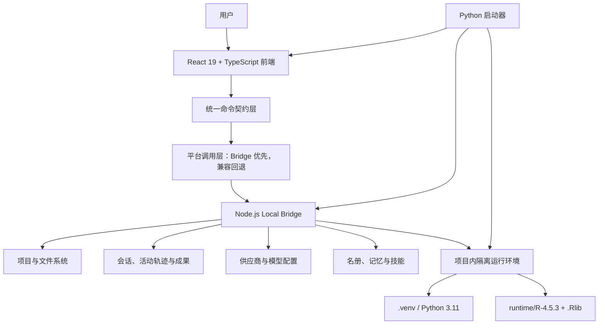

# 师门 ShiMen（The Mentorship Guild）

<div align="center">
  

  <p><strong>面向 Windows 的本地智能体工作台</strong></p>
  <p>把项目、连续会话、智能体人格、专业技能、模型供应商、成果文件与隔离运行环境统一到一个可管理、可追溯、可迁移的桌面工作空间中。</p>

  <p>
    
    
    
    
    
    
  </p>
</div>

> [!IMPORTANT]
> 师门是本地优先的智能体工作台，不提供模型账号、API Key、调用额度或第三方平台服务。用户需要自行选择供应商、获取合法有效的 API Key，并对第三方平台的费用、可用性、数据政策与服务条款负责。

> [!NOTE]
> 当前前端包版本为 `0.5.6`，Python 兼容层版本为 `0.1.0`。仓库仍处于快速迭代阶段；本文严格区分“当前已经实现的能力”“需要外部环境配合的能力”和“仅保留接口的扩展方向”。

---

## 目录

- [产品简介](#产品简介)
- [适用人群](#适用人群)
- [核心价值](#核心价值)
- [功能总览](#功能总览)
- [界面与模块](#界面与模块)
- [五分钟快速上手](#五分钟快速上手)
- [安装与运行](#安装与运行)
- [首次启动与新手引导](#首次启动与新手引导)
- [供应商与模型配置](#供应商与模型配置)
- [项目管理](#项目管理)
- [对话与连续会话](#对话与连续会话)
- [名册与智能体人格](#名册与智能体人格)
- [多智能体工作流基础](#多智能体工作流基础)
- [记忆系统](#记忆系统)
- [技能工具与上下文](#技能工具与上下文)
- [附件成果与可视化](#附件成果与可视化)
- [配置管理](#配置管理)
- [环境检查与运行时隔离](#环境检查与运行时隔离)
- [本地数据与隐私边界](#本地数据与隐私边界)
- [系统架构](#系统架构)
- [目录结构](#目录结构)
- [开发环境搭建](#开发环境搭建)
- [构建便携版](#构建便携版)
- [构建安装包](#构建安装包)
- [发布前验收](#发布前验收)
- [备份迁移与恢复](#备份迁移与恢复)
- [常见问题与故障排查](#常见问题与故障排查)
- [安全建议](#安全建议)
- [当前实现边界](#当前实现边界)
- [开发者接口索引](#开发者接口索引)
- [贡献与维护约定](#贡献与维护约定)
- [许可证](#许可证)

---

## 产品简介

师门是一套面向 Windows 的本地智能体工作台。它不把智能体简化成一个无状态聊天框，而是围绕真实工作建立完整的本地工作空间：

1. 以“项目”划定文件与任务边界。
2. 以“会话”保存长期上下文与执行轨迹。
3. 以“名册”定义不同智能体的人格、职责、表达方式、行为约束和可调用技能。
4. 以“供应商”管理 API、协议、模型目录、默认模型与推理强度。
5. 以“技能和工具”扩展研究、分析、绘图、文档与自动化能力。
6. 以“成果文件”把 Markdown、PDF、Word、演示文稿、表格、SVG 和图片从文本路径提升为可预览、可打开、可下载的交付物。
7. 以独立的 `CDXAgent/` 运行目录隔离配置、认证、会话、技能、日志和状态，降低误用系统级环境的风险。

从用户视角看，师门是一套带项目记忆、角色分工和成果管理能力的本地 AI 工作台；从工程视角看，它是一套由 React 前端、本地 Node.js Bridge、Python 启动器、隔离运行时和兼容层组成的可扩展架构。

### 产品设计原则

| 原则 | 具体含义 |
| --- | --- |
| 本地优先 | 项目索引、会话索引、配置、名册、记忆和技能优先保存在本机目录。 |
| 明确隔离 | 应用使用项目内 `CDXAgent/`，避免无意读取或改写用户系统级智能体配置。 |
| 可追溯 | 会话、工具调用、思考与规划、成果文件和活动轨迹尽可能形成可回看记录。 |
| 可管理 | 供应商、模型、项目、会话、技能、名册和增强能力均有统一管理入口。 |
| 可扩展 | 前端契约、Bridge 路由、Python 门面和适配器分层，便于替换或增加底层能力。 |
| 不夸大能力 | 预留接口不等同于已经联调完成；外部服务可用性不等同于本地代码可用性。 |

---

## 适用人群

师门适合以下场景：

- 需要在多个本地项目之间切换，并保留各自上下文的研究人员、开发者和内容工作者。
- 希望为不同任务建立稳定人格、职责和技能边界的智能体用户。
- 需要长时间运行数据分析、文献整理、代码处理、图表生成或报告制作任务的用户。
- 需要集中管理多个兼容供应商、模型列表、默认模型和推理强度的用户。
- 需要把生成的 Markdown、PDF、DOCX、PPTX、XLSX、SVG、PNG 等成果直接展示在对话中的用户。
- 希望将完整工作台制作成便携包或图形化安装包，在新电脑上快速部署的维护者。

师门并不适合以下情况：

- 希望完全不配置 API、也不安装任何运行依赖便立即使用第三方模型。
- 希望将 Bridge 直接暴露到公网而不增加认证、HTTPS、访问控制和审计。
- 希望仅凭一个模型回答替代专业医疗、法律、财务或实验安全决策。
- 希望把第三方供应商的可用性、价格和模型真实性视为本项目的保证范围。

---

## 核心价值

### 1. 从“聊天”升级为“项目工作”

每个项目绑定真实文件夹。会话、附件、命令、成果文件和智能体执行均围绕该目录展开，避免把不同任务混入同一上下文。

### 2. 从“统一助手”升级为“名册中的角色”

每个智能体可以拥有独立的角色定位、职责说明、表达风格、行为约束和技能清单。角色配置会参与实际任务提示，不只是前端展示标签。

### 3. 从“模型下拉框”升级为“供应商配置中心”

供应商页直接读取隔离环境中的真实 `model_providers` 配置。用户可以获取上游模型、先筛选候选模型、删除不需要的条目、设置默认模型并保存到隔离配置。

### 4. 从“黑箱等待”升级为“执行轨迹”

前端可以展示运行状态、思考与工具规划、工具调用分组、会话活动轮次和成果文件。内部脚手架命令会被过滤，尽量只保留对用户有意义的执行记录。

### 5. 从“文本路径”升级为“可操作成果”

当回复中出现受支持的本地成果路径时，前端将其渲染为文件卡片，提供预览、系统打开和下载操作。Mermaid 流程图也可以直接渲染为图形。

### 6. 从“共享全局配置”升级为“项目内隔离运行时”

应用启动时会为 Bridge 注入独立的运行目录、技能目录、Python 虚拟环境和 R 库路径。概况页会显示实际二进制路径、运行目录、隔离状态与技能扫描结果。

---

## 功能总览

| 功能域 | 当前能力 | 数据落点 |
| --- | --- | --- |
| 对话 | 新建/继续会话、流式输出、中止任务、复制消息、智能体切换 | `CDXAgent/sessions/`、状态数据库 |
| 项目 | 添加、筛选、标签、备注、逻辑合并、拆分、终端打开、项目设置 | 本地项目目录、Bridge 状态文件 |
| 会话 | 列表、检索、重命名、删除、活动轨迹、Markdown 导出 | 隔离会话目录与本地索引 |
| 供应商 | 六类模板索引、API Key、上游模型获取、候选筛选、模型删除、默认模型 | `CDXAgent/config.toml`、`CDXAgent/auth.json`、Bridge 状态 |
| 名册 | 查看与激活智能体、人格字段、技能和记忆；增删改接口保留供开发维护 | `CDXAgent/lmentor-bridge-state.json` |
| 记忆 | 共享记忆、专属记忆、启停、删除、对指定智能体隐藏 | `CDXAgent/lmentor-bridge-state.json` |
| 技能 | 扫描、展示、文件导入、隔离运行时迁移预览与执行 | `CDXAgent/skills/` |
| 工具与上下文 | MCP、Skill、Plugin 条目管理，自定义命令 | Bridge 状态与隔离目录 |
| 成果文件 | Markdown、PDF、Office、表格、SVG、图片等文件卡片 | 当前项目目录或任务输出目录 |
| 可视化 | Mermaid 自动识别与渲染，图片内联预览 | 会话内容与本地成果文件 |
| 配置 | 表单编辑、原生配置编辑、模板、备份、导入、导出 | 隔离配置及备份目录 |
| 环境 | Node.js、npm、Python、智能体运行环境检查与版本提示 | 当前机器与项目内运行时 |
| 增强 | 总开关、语言、会话/项目/插件与守护类增强设置 | Bridge 状态与运行时配置 |
| 打包 | Nuitka 便携版、图形化安装器、桌面快捷方式、卸载器 | `build/portable/`、`build/installer/` |

---

## 界面与模块

应用主界面由“对话”和“管理”两部分组成。管理页左侧包含九个固定模块。

### 对话页

- 顶栏：当前智能体、模型、推理强度、主题、字体和管理入口。
- 左侧：项目与会话导航。
- 中部：用户消息、智能体消息、任务交接、思考与工具规划、成果文件。
- 右侧：项目动作与工具调用轮次。
- 输入区：附件、技能选择、访问模式、发送和中止。
- 输入区下方：当前激活智能体提示。

### 管理页

| 页签 | 主要用途 |
| --- | --- |
| 概况 | 查看当前供应商、会话数、工具数、增强状态、隔离运行时和技能根目录。 |
| 名册 | 设置用户名和师门名，维护智能体人格、技能与记忆。 |
| 项目 | 添加、检索、筛选、管理、合并和进入本地项目。 |
| 会话 | 跨项目检索、查看、导出或删除会话。 |
| 供应商 | 配置 API、协议、模型目录、默认模型与推理强度。 |
| 工具 | 管理技能、MCP、插件条目和隔离运行时迁移。 |
| 增强 | 控制本地增强行为和部分运行时注入。 |
| 配置 | 编辑原生或结构化配置，管理模板、备份、导入和导出。 |
| 环境 | 检查 Node.js、npm、Python 和运行环境状态。 |

管理页左上角提供“返回对话”，并保留“重新查看新手引导”入口。

---

## 五分钟快速上手

如果你使用正式安装包，推荐按以下顺序操作：

1. 双击 `Lmentor-Setup.exe`。
2. 阅读欢迎页，确认 Python 3.11 与 R 4.5.3 环境要求。
3. 如果未检测到 Python 3.11，勾选同意启动随附安装程序。
4. 如果未检测到 R 4.5.3，勾选同意使用安装包内置 R 环境。
5. 选择安装目录。目录名建议使用英文，且不能直接选择磁盘根目录。
6. 阅读 API 获取说明并完成二次确认。
7. 等待主程序释放、运行环境绑定和桌面快捷方式创建。
8. 首次启动时填写用户名和师门名；留空会使用“用户”和“师门”作为兜底值。
9. 进入“管理 → 供应商”，选择带“推荐”标记的 LinkBus 或其他模板。
10. 获取并填写 API Key，点击“从上游获取模型”。
11. 在候选模型中筛选并加入需要的模型，删除多余模型。
12. 选择默认模型，设置推理强度，保存配置。
13. 进入“管理 → 项目”，添加一个本地工作目录。
14. 返回对话页，选择项目和智能体后开始任务。

> [!TIP]
> 第一次配置模型时，建议只保留实际会使用的 2～5 个模型。模型列表越精简，后续选择越清晰，也能减少误用错误模型名称的概率。

---

## 安装与运行

### 方式一：图形化安装包

适合普通用户和新电脑部署。

安装器当前包含以下步骤：

1. 欢迎与安装范围说明。
2. Python 3.11 检测及用户授权。
3. R 4.5.3 检测及内置环境授权。
4. 英文安装目录选择。
5. API 获取说明和二次确认。
6. 主程序释放、环境重绑定和桌面快捷方式创建。
7. 安装完成后可选择立即启动。

默认安装目录由安装器界面决定。安装器不允许直接安装到磁盘根目录，以避免卸载和覆盖范围失控。

### 方式二：便携版

适合测试、迁移、离线分发和无需写入传统安装目录的场景。

1. 完整解压 `Lmentor-Portable.zip`。
2. 不要只把 `Lmentor.exe` 单独复制出来；`core/`、`CDXAgent/` 和 `Lmentor-Environment.zip` 等内容是运行所需组成部分。
3. 双击 `Lmentor.exe`。
4. 首次启动会自动展开 `Lmentor-Environment.zip`，并将 `.venv` 重绑定到当前电脑的 Python 3.11；后续启动不再重复展开。
5. 等待启动图片结束后，观察启动窗口中的 Bridge、前端和隔离运行环境状态。
6. 浏览器或桌面壳打开 `http://127.0.0.1:1420` 后进入主界面。

> [!WARNING]
> 便携版的“可移动”指整个发布目录可移动，不代表任意单文件运行。移动时必须保留目录结构。

### 方式三：从源码运行

适合开发和调试。详细步骤见[开发环境搭建](#开发环境搭建)。

```powershell
cd <仓库目录>\Lmentor-windows
python main.py
```

不自动打开浏览器：

```powershell
python main.py --no-browser
```

指定前端和 Bridge 端口：

```powershell
python main.py --frontend-port 1420 --bridge-port 4318
```

### 默认本地地址

| 服务 | 默认地址 | 用途 |
| --- | --- | --- |
| 前端 | `http://127.0.0.1:1420` | 用户界面 |
| Bridge 健康检查 | `http://127.0.0.1:4318/api/health` | 判断 Bridge 是否就绪 |
| Bridge 调用入口 | `http://127.0.0.1:4318/api/invoke` | 前端统一命令调用 |

Bridge 默认只绑定 `127.0.0.1`。不要在未增加认证和加密的情况下改为公网监听。

---

## 首次启动与新手引导

### 用户名与师门名

首次启动时，应用会检查用户名与师门名：

- 两项均未配置：显示身份设置窗口。
- 用户填写后：保存到本地名册状态。
- 用户留空：分别以“用户”和“师门”作为兜底值。
- 已经配置：后续启动显示欢迎提示“`用户名`阁下，欢迎来到`师门名`”。

用户名用于替代会话中的硬编码“用户”标签；师门名用于欢迎语和名册身份信息，不会改写应用固定标题。

### 新手引导出现条件

新手引导用于完全未配置的首次安装状态，不应在每次进出首页时重复弹出。完成后会写入本地完成标记。

如需再次查看：

1. 进入“管理”。
2. 点击左侧顶部的闪光图标。
3. 选择“重新查看新手引导”。

引导采用聚焦说明，但不应阻断其他控件，也不使用高斯模糊遮罩。

### 新手引导标准路径


---

## 供应商与模型配置

### 工作原理

供应商页不是独立的前端预设表单。它会读取隔离环境的实时配置，并将保存结果写回 `CDXAgent/config.toml` 中对应的 `model_providers` 段，同时更新根级当前供应商字段。

一次完整保存至少涉及：

- 当前供应商标识。
- 供应商名称与 `provider_id`。
- `base_url`。
- 协议类型。
- 供应商模式。
- 默认模型。
- 已保留模型列表。
- 推理强度。
- API Key 或认证内容。

切换供应商卡片时，页面会加载该供应商自己的配置；API Key 不应被其他供应商卡片的模板内容覆盖。

### 默认供应商索引

隔离配置模板当前保留七个供应商入口：

| 供应商 | 标识 | 类型 | 默认地址 | 说明 |
| --- | --- | --- | --- | --- |
| LinkBus | `linkbus` | 国际模型聚合入口 | `https://www.linkbus.net/v1` | 默认推荐卡片 |
| JuAPI | `juapi` | 国际模型聚合入口 | `https://www.juapi.net/v1` | 可选国际模型入口 |
| 灵石 | `lingshi` | 国际模型入口 | `https://api.lingshi.chat/v1` | 兼容 Responses 协议 |
| Infinity | `Infinity` | 本地/自定义聚合入口 | `http://192.69.93.161:8080` | 地址可按部署调整 |
| 七牛云 | `qiniu` | 国产模型聚合平台 | `https://api.qnaigc.com` | 适合拉取全站模型后筛选 |
| AIOnly | `aionly` | 国产模型聚合平台 | `https://api.aiionly.com` | 适合拉取全站模型后筛选 |
| 硅基流动 | `siliconflow` | 国产模型聚合平台 | `https://api.siliconflow.cn` | 适合拉取全站模型后筛选 |

> [!NOTE]
> 上表说明当前模板索引，不构成第三方平台背书。第三方地址、模型目录、价格和可用性可能随时变化。

### 获取 API

供应商详情右上角提供固定的“获取 API”按钮。弹窗包含六个入口：

| 平台 | 注册或登录地址 |
| --- | --- |
| LinkBus | <https://www.linkbus.net/register?aff=2Gn4> |
| 灵石 | <https://api.lingshi.chat/register?aff=GSNj> |
| Infinity | <http://192.69.93.161:8080/register?aff=T2MN7K8VMFHR> |
| JuAPI | <https://cdn.juaiapi.com/register?invite_code=qLUM> |
| 七牛云 | <https://s.qiniu.com/jEBVVz> |
| AIOnly | <https://maas.aiionly.com/login/6951720986> |
| 硅基流动 | <https://cloud.siliconflow.cn/i/iaY91bIJ> |

通用操作流程：

1. 打开对应站点，根据页面指引完成注册。
2. 登录后进入令牌、API Key 或密钥管理页面。
3. 新建令牌；如平台提供分组，按平台说明选择可用分组。
4. 完整复制密钥文本。
5. 使用本地备忘录或密码管理器妥善备份。
6. 回到对应供应商卡片，把密钥填入 API Key 输入框。

### 从上游获取模型

1. 选择供应商。
2. 确认 `Base URL` 正确。
3. 填写该供应商对应的 API Key。
4. 点击“从上游获取模型”。
5. 普通供应商可以直接形成模型列表；聚合平台会先进入候选模型区。
6. 使用关键词筛选候选模型。
7. 勾选需要的模型并加入正式列表。
8. 继续筛选正式列表，批量删除不需要的模型。
9. 选择默认模型。
10. 保存配置。

候选模型区相当于“第三只手”：上游返回大量模型时，不会不加选择地把全站目录写入正式模型列表。

### 模型 ID 清洗

前端会对模型 ID 做基础清洗：

- 去除首尾空白。
- 去除空条目。
- 去重。
- 仅接受字母、数字、点、下划线、冒号、斜线和连字符。
- 过滤明显不是模型 ID 的随机乱码或密钥样式字符串。

这一步用于降低类似随机长字符串误入模型列表的概率，但不能替代供应商端正确返回数据。

### 推理强度

支持四档推理强度：

| 档位 | 配置值 | 适用场景 |
| --- | --- | --- |
| 低 | `low` | 简单问答、快速改写、低延迟任务 |
| 中 | `medium` | 日常开发、常规分析、默认平衡档 |
| 高 | `high` | 复杂推理、研究设计、严谨报告 |
| 超高 | `xhigh` | 高难度、多步骤、允许更高延迟的任务 |

对话页顶栏可以快速切换推理强度。切换结果会写入当前供应商配置，后续消息按新档位运行；正在流转的会话期间会限制切换，以避免同一轮参数不一致。

### 保存后的配置关系

示意结构如下：

```toml
model = "your-default-model"
model_provider = "your-provider-id"
model_reasoning_effort = "medium"

[model_providers.your-provider-id]
name = "Your Provider"
provider_id = "your-provider-id"
base_url = "https://example.com/v1"
wire_api = "responses"
protocol = "responses"
mode = "pure_api"
model = "your-default-model"
models = ["your-default-model", "another-model"]
reasoning_effort = "medium"
```

不要在公开 Issue、截图、日志或提交记录中展示真实 API Key。

---

## 项目管理

### 什么是项目

项目是师门中的主要工作边界，对应一个真实本地目录。选择项目后：

- 会话在该目录上下文中创建或继续。
- 附件与成果路径相对于该目录解析。
- 终端在该目录打开。
- 项目级权限、Hooks 和环境变量可分别保存为共享或本地设置。
- 智能体可以读取该目录中被允许访问的文件。

### 添加项目

1. 进入“管理 → 项目”。
2. 点击“添加项目”。
3. 使用文件夹按钮打开系统目录选择器，或手动输入绝对路径。
4. 确认目录存在并提交。
5. 项目卡片出现后点击进入会话。

如果文件夹选择器超过 30 秒无响应，应检查 Bridge 是否正在运行、浏览器是否允许本地对话框调用，以及是否有旧 Bridge 进程占用端口。

### 项目筛选

项目页支持：

- 按名称搜索。
- 按路径搜索。
- 按标签搜索。
- 按标签按钮筛选。
- 按关联智能体筛选。
- 刷新项目索引。

### 项目元信息

每个项目可以维护：

- 自定义名称。
- 标签。
- 备注。
- 关联智能体。

元信息用于前端组织，不会自动重命名真实文件夹。

### 逻辑合并与拆分

项目管理模式允许选择多个项目进行逻辑合并：

- 合并只改变师门中的展示关系。
- 不移动、不复制、不删除真实目录。
- 可以再次拆分。
- 主项目用于承载合并后的入口。

### 项目级设置

项目设置分为两类：

| 类型 | 用途 | 建议 |
| --- | --- | --- |
| 共享设置 | 团队可复用的模型、权限、Hooks 和环境配置 | 可纳入版本控制前先检查敏感信息 |
| 本地设置 | 仅当前机器使用的权限、路径和环境配置 | 不应提交私密路径或密钥 |

支持的主要字段包括权限模式、允许列表、拒绝列表、Hooks 和环境变量。

---

## 对话与连续会话

### 发起对话

1. 先选择项目。
2. 选择当前智能体。
3. 确认模型与推理强度。
4. 选择自动技能或手动技能。
5. 根据需要添加附件。
6. 输入问题并按 `Enter` 发送；`Shift + Enter` 换行。

发送后，输入框会清空。若仍保留旧输入，通常说明前端发送状态没有完成提交，应先确认任务是否已经在后端运行，避免重复发送。

### 连续会话

师门支持在同一会话中继续输入。连续会话应满足：

- 每次用户输入只出现一次。
- 每轮回复按真实时间顺序追加。
- 流式任务刷新页面后仍能恢复进行状态。
- 新轮次不会错误合并到上一轮。
- 中间智能体交接不会复制原始用户消息。
- 任务完成后，思考内容、工具记录和最终答案保持正确分类。

### 消息视觉规则

- 用户消息使用独立气泡，与智能体消息保持明显间距。
- 用户气泡使用蓝色背景，并根据主题自动选择高对比文字。
- 智能体消息使用浅色主题白底黑字、深色主题黑底白字。
- 同一条思考过程不会按换行拆成多个气泡。
- 思考与工具规划进入单独可展开区域。
- 最终答案保留在主消息区域，不应误收进思考折叠项。

### 工具调用展示

- 流式过程中实时显示工具状态。
- 完成后从持久化会话恢复相同记录。
- 内部脚手架命令会被过滤，避免长期显示无意义的运行包装器。
- 项目动作侧栏每个卡片默认展示最多三条命令；超过三条可展开。
- 工具状态区分运行中、成功和错误。

### 中止任务

任务运行时，发送按钮会变为停止按钮。点击后调用会话中止接口；中止是尽力操作，部分已启动的外部子进程可能需要额外时间退出。

### 访问模式

输入区可以展示或切换访问模式，具体选项由当前运行环境和项目设置决定：

- 默认：完全访问。
- 完全访问权限。
- 计划模式。

如果当前智能体不支持动态切换，控件会以只读方式显示。完全访问权限会降低文件和命令保护，只有在可信项目中才应使用。

---

## 名册与智能体人格

### 名册结构

名册页采用左侧列表、右侧详情布局：

- 左侧：用户名、师门名、智能体列表和激活状态。
- 右侧：角色定位、职责说明、表达风格、行为约束、技能与记忆。

### 人格字段

| 字段 | 作用 | 编写建议 |
| --- | --- | --- |
| 名称 | 对话中展示的智能体姓名 | 简短、唯一、易识别 |
| 角色定位 | 说明其专业身份 | 使用正式职业或职责定位 |
| 职责说明 | 定义负责什么、不负责什么 | 写清输入、处理方式和产出 |
| 表达风格 | 控制语气、结构和措辞 | 使用可执行的语言要求 |
| 行为约束 | 约束决策顺序、证据边界和交接 | 避免只写抽象人格形容词 |
| 可使技能 | 限定优先可调用的技能 | 只勾选与职责真正相关的技能 |
| 启用状态 | 控制是否可被选择 | 停用后保留配置但不参与正常选择 |

### 智能体维护边界

当前用户界面不提供“新增智能体”和“保存配置”按钮。用户可以查看已有智能体、切换当前智能体、维护用户名与师门名，并使用记忆相关功能。

新增和编辑智能体的命令契约与 Bridge 接口仍然保留，供开发人员通过受控的维护流程调用。新建智能体接口仍以空角色定位、空职责说明、空表达风格、空行为约束和空技能列表为默认值，不会自动套用内置导师模板。

### 删除智能体

删除操作需要二次确认。删除后，该智能体的人格和技能绑定无法自动恢复。内置角色是否允许删除由后端规则决定。

### 激活与新会话

点击顶栏中的智能体：

- 已选择项目：切换到该智能体并开启新对话。
- 尚未选择项目：跳转到项目创建或选择入口。

这样可以避免在同一会话中途无提示地改变人格。

---

## 多智能体工作流基础

名册包含多智能体交接的基础约束：

1. 每个智能体只在既定角色边界内工作。
2. 当任务明显更适合另一智能体时，当前智能体先理解任务，再生成结构化交接。
3. 交接摘要至少包括任务目标、已知事实、既有判断、未决问题和下一步行动。
4. 当前智能体能够独立完成时，应直接完成，不应为了展示多智能体而强制交接。
5. 交接判断由任务内容、角色职责和技能匹配共同决定，不应仅靠硬编码关键词。

推荐的完整链路：



### 任务包、结果包与交付包

| 包类型 | 必须包含 |
| --- | --- |
| 任务包 | 原始目标、输入路径、限制条件、期望交付、责任智能体 |
| 结果包 | 方法、参数、统计结果、限制、可复用表格、下一阶段建议 |
| 交付包 | 成果路径、格式、预览信息、生成依据、质量检查结果 |

前端显示交接时，应只显示一次原始用户消息和一次交接卡片，避免把任务包伪装成第二条用户输入。

---

## 记忆系统

记忆属于名册，而不是单一会话。当前支持：

- 新建记忆。
- 编辑标题和内容。
- 启用或停用。
- 全体共享。
- 仅指定智能体可见。
- 对某个智能体标记为“不知”。
- 反向取消“不知”标记。
- 删除记忆。

### 可见性规则

| 状态 | 行为 |
| --- | --- |
| `shared = true` | 默认对所有启用智能体可见 |
| `shared = false` | 仅 `visible_to` 中的智能体可见 |
| `hidden_for` 包含某智能体 | 即使是共享记忆，该智能体也不应收到该记忆 |
| `enabled = false` | 暂停注入，但保留记录 |

### 典型用法

- “项目使用牛参考基因组”可作为共享记忆。
- “某角色不知道尚未公开的实验分组”可添加对应“不知”标记。
- 临时无效的信息可以停用，避免删除后无法恢复。
- 记忆中不要保存 API Key、密码、身份证件、患者隐私或未授权数据。

---

## 技能工具与上下文

### 技能选择

输入区支持两种技能模式：

| 模式 | 行为 |
| --- | --- |
| 自动选择 | 当前智能体先检查自身已启用技能；匹配则优先调用，不匹配则使用模型通用能力 |
| 手动选择 | 用户明确勾选本轮优先使用的技能 |

技能列表会展示名称、用途、来源和系统/用户属性。

### 隔离技能库

默认主要技能目录为：

```text
CDXAgent/skills/
```

启动器和概况页还会检查应用目录下的 `skills/`、本机代理技能目录、`.lmentor/skills/` 及活动运行目录中的多个受控技能根路径。

项目内 `CDXAgent/skills` 是隔离环境的主技能库，不应递归同步到自身。

### 当前仓库中的技能类型

当前隔离技能目录包含研究、联网、图像、文档、表格、PDF、SVG、技能创建、技能安装、插件创建、思维导图和自我改进等类型。目录内容会随发布版本变化，应以“管理 → 工具”和“概况 → Skill 根目录”的实时扫描结果为准。

### 导入技能

1. 进入“管理 → 工具”。
2. 选择技能导入。
3. 选择包含 `SKILL.md` 的技能文件或目录。
4. 先执行校验。
5. 确认技能名称、结构和目标目录。
6. 安装到隔离技能库。
7. 等待实时列表刷新。

中文技能文件应以 UTF-8 保存。在 PowerShell 中处理中文文件时，必须显式使用原生 UTF-8 参数，避免中文被替换为问号或出现乱码。

示例：

```powershell
Get-Content -LiteralPath .\SKILL.md -Raw -Encoding UTF8
Set-Content -LiteralPath .\SKILL.md -Value $content -Encoding UTF8
```

### 运行时内容迁移

工具页支持对其他本地运行目录执行：

1. 来源扫描。
2. 导入预览。
3. 分类选择会话、技能、MCP、插件或配置。
4. 执行导入。
5. 查看结果统计。

迁移逻辑应跳过：

- `auth.json`。
- 沙箱秘密文件。
- Token、Secret、Password、Credential 等敏感配置键。
- 明确不在授权范围内的本机配置。

### MCP、Skill 与 Plugin 条目

工具页可以管理三类上下文记录：

- MCP 服务。
- Skill 技能。
- Plugin 插件。

每条记录可以创建、编辑、启用、停用和删除。条目存在不代表外部服务一定可用，仍需检查其可执行文件、网络、认证和依赖。

---

## 附件成果与可视化

### 输入附件

对话输入支持：

- 点击附件按钮选择文件。
- 拖拽文件到输入框。
- 从剪贴板识别本地文件路径。
- 为附件编辑显示标签。
- 多文件按上传顺序编号。
- 发送前移除不需要的附件。

附件仍受当前项目路径、访问模式和运行环境权限约束。

### 成果文件卡片

支持识别以下常见格式：

| 类别 | 扩展名示例 | 前端操作 |
| --- | --- | --- |
| 文本 | `.md` `.markdown` `.txt` `.json` `.html` | 预览、系统打开、下载 |
| 文档 | `.pdf` `.doc` `.docx` | 视格式预览、系统打开、下载 |
| 演示 | `.ppt` `.pptx` | 系统打开、下载 |
| 表格 | `.xlsx` `.xls` `.csv` | 视格式预览、系统打开、下载 |
| 矢量图 | `.svg` | 预览、系统打开、下载 |
| 位图 | `.png` `.jpg` `.jpeg` `.gif` `.webp` `.bmp` | 内联预览、系统打开、下载 |

当智能体在回复中提供符合规则的本地路径时，前端会把普通 Markdown 链接提升为大尺寸成果卡片。

### Mermaid 流程图

前端支持 Mermaid 11，并会自动识别未包裹代码围栏的常见图表定义。推荐仍使用标准写法：

````markdown

````

支持的常见类型包括流程图、时序图、类图、状态图、ER 图、甘特图、饼图、思维导图、时间线等。渲染使用严格安全模式。

### 真正的图像思维导图

思维导图技能应生成实际 SVG/PNG/PDF 成果，而不是仅输出 Markdown 层级文本。生成后应在回复中给出可识别路径，使前端渲染成果卡片。

---

## 配置管理

配置页支持两条路径：

### 结构化配置

当当前运行环境支持结构化配置时，页面提供：

- 模型设置。
- 权限与安全。
- 环境变量。
- MCP 服务 JSON。
- 启用插件。
- 高级选项。
- 模板管理。
- 自动备份和恢复。
- 导入与导出。

### 原生配置

当结构化读取失败但原生文件可用时，页面回退到原生格式编辑器。保存前应确认编码为 UTF-8，并避免破坏 TOML/JSON 语法。

### 模板

模板适合保存不含密钥的通用组合，例如：

- 默认模型与推理强度。
- 权限模式。
- 沙箱策略。
- 允许/拒绝规则。
- MCP 结构。

模板不应保存真实 API Key 或个人路径。

### 备份

配置保存前会创建备份记录。用户可以在“配置 → 备份”中查看并恢复历史版本。恢复前仍建议复制当前配置作为额外保险。

---

## 环境检查与运行时隔离

### 环境检查页

环境页检查：

- Node.js。
- npm。
- Python。
- 当前已注册的智能体运行环境。
- 可用版本与更新提示。

检查失败时提供重试和直接进入入口。直接进入只跳过当前检查界面，不会自动补齐缺失依赖。

### 隔离目录

`CDXAgent/` 是应用的核心隔离目录，典型内容包括：

```text
CDXAgent/
├── bin/                         # 隔离运行环境可执行文件
├── config.toml                  # 模型、供应商、权限与项目配置
├── auth.json                    # 隔离认证信息
├── lmentor-bridge-state.json    # 项目、名册、记忆、偏好等工作台状态
├── sessions/                    # 会话记录
├── archived_sessions/           # 归档会话
├── skills/                      # 隔离技能库
├── plugins/                     # 插件目录
├── logs/                        # 运行日志
├── tmp/                         # 临时文件
└── *.sqlite*                    # 运行环境状态数据库
```

### 启动时的环境绑定

Python 启动器会向 Bridge 注入：

| 变量 | 目标 |
| --- | --- |
| `LMENTOR_APP_ROOT` | 当前应用根目录 |
| 隔离运行主目录变量 | 项目内 `CDXAgent/` 运行目录 |
| 隔离运行命令变量 | 当前项目内运行可执行文件 |
| `VIRTUAL_ENV` | 项目内 `.venv` |
| `PYTHON` | `.venv/Scripts/python.exe` |
| `PIP` | `.venv/Scripts/pip.exe` |
| `R_HOME` | 内置或受控的 R 4.5.3 目录 |
| `R_LIBS_USER` | 项目内 `.Rlib` |

### Python 选择规则

- 项目运行任务优先使用 `.venv/Scripts/python.exe`。
- 安装器检测并绑定 Python 3.11。
- 安装到新电脑后，`.venv/pyvenv.cfg` 会重写到该电脑实际 Python 3.11 路径。
- 直接使用便携版时，首次展开环境归档后也会执行相同的 Python 3.11 重绑定。
- 不应保留开发电脑上的绝对 Python 3.11 路径。

### R 选择规则

启动器依次检查：

1. `runtime/R-4.5.3`。
2. 已设置的 `R_HOME`。
3. `C:\Program Files\R\R-4.5.3`。

发现 `Rscript.exe` 后，将其 `bin` 加入 Bridge 的 `PATH`，并把用户库固定到项目内 `.Rlib`。

### 概况页验证

“管理 → 概况”会显示：

- 运行模式、版本与平台。
- 是否与系统默认环境隔离。
- 是否使用项目内运行环境。
- 实际二进制路径。
- 实际运行主目录。
- 技能数量与最近扫描时间。
- 各技能根目录是否存在及其计数。
- Bridge 诊断日志。

点击“重启隔离运行环境”只应重启项目内运行环境，不应干预系统级环境。

---

## 本地数据与隐私边界

### 会被保存在本机的内容

- 供应商资料和模型选择。
- 隔离认证信息。
- 项目索引和隐藏状态。
- 会话名称和会话内容。
- 名册、人格与技能绑定。
- 共享/专属记忆。
- 主题、字体、语言和新手引导状态。
- 工具、MCP、插件和增强设置。
- 日志、SQLite 状态与临时文件。

### 不应进入发布包的内容

- 真实 API Key。
- 用户私有项目路径。
- 用户名和自定义师门名。
- 个人会话和历史记录。
- 记忆条目。
- 用户主题偏好。
- 运行日志和调试输出。
- 数据库 WAL/SHM 临时状态。
- 开发电脑的 Python、R 或用户目录绝对路径。

### 发布模板原则

发布前应保留：

- 六个供应商模板结构。
- 空 API Key。
- 空用户身份。
- 空项目列表。
- 默认名册模板或产品预设角色。
- 必需技能和运行环境。
- 可启动的 `config.toml` 模板与空认证结构。

“删除个性化数据”不等于删除供应商模板、技能或运行环境。

---

## 系统架构



### 分层职责

| 层级 | 主要位置 | 职责 |
| --- | --- | --- |
| 启动与监控 | `main.py` | 启动图片、端口预检、Bridge/前端编排、运行时绑定、健康检查、自动恢复 |
| 前端工作台 | `frontend-shell/src/` | 页面、主题、会话 UI、名册、供应商、项目、成果预览 |
| 命令契约 | `frontend-shell/src/lmentor/api/contracts.ts` | 注册前端允许调用的命令，限制未登记路由 |
| 平台调用 | `frontend-shell/src/lmentor/platform/` | Bridge 调用、事件、窗口和文件对话框适配 |
| 本地 Bridge | `frontend-shell/scripts/*bridge.mjs` | 项目、会话、配置、工具、供应商、名册与运行环境调度 |
| Python 兼容层 | `lmentor/` | 契约、注册表、门面和适配器基础 |
| 隔离运行环境 | `CDXAgent/` | 配置、认证、会话、技能、插件、日志与数据库 |
| 打包系统 | `scripts/` | 便携版、安装器、卸载器、图标与运行环境封装 |

### 前端调用边界

前端调用遵循：

```text
页面/组件
  → useInvoke / invokeCommand
  → 命令契约注册表
  → 平台核心调用层
  → 本地 Bridge
  → 隔离运行环境或本地文件系统
```

未在契约中注册的命令会被前端接口层拒绝。`verify:phase0` 会检查契约路由是否由 Bridge 或兼容网关承接。

---

## 目录结构

```text
Lmentor-windows/
├── README.md
├── main.py
├── pyproject.toml
├── requirements.txt
├── requirements-native-bio.txt
├── r-requirements.txt
├── 1554.png
├── 11.png
├── 1.xlsx
│
├── lmentor/
│   ├── contracts.py
│   ├── registry.py
│   ├── facade.py
│   ├── compat.py
│   └── adapters/
│
├── frontend-shell/
│   ├── public/
│   │   └── app-logo.png
│   ├── src/
│   │   ├── agents/
│   │   ├── components/
│   │   ├── hooks/
│   │   ├── i18n/
│   │   ├── lmentor/
│   │   ├── pages/
│   │   └── types/
│   ├── scripts/
│   │   ├── *bridge.mjs
│   │   ├── build.mjs
│   │   └── verify-phase0.mjs
│   ├── package.json
│   └── vite.config.ts
│
├── CDXAgent/
│   ├── bin/
│   ├── config.toml
│   ├── auth.json
│   ├── lmentor-bridge-state.json
│   ├── sessions/
│   ├── skills/
│   ├── plugins/
│   └── logs/
│
├── scripts/
│   ├── build-portable-exe.ps1
│   ├── build-installer.ps1
│   ├── portable-launcher.c
│   └── installer/
│       ├── LmentorSetupApp.cs
│       ├── UninstallApp.cs
│       └── install-lmentor.*
│
├── .venv/
├── .Rlib/
├── runtime/
│   ├── node/
│   └── R-4.5.3/
└── build/
    ├── portable/
    └── installer/
```

`.venv/`、`.Rlib/`、`runtime/` 和 `build/` 是否存在取决于当前开发或打包状态。

---

## 开发环境搭建

### 系统要求

- Windows 10 或 Windows 11，64 位。
- Python 3.11。
- Node.js 18+；建议使用当前 LTS。
- npm。
- R 4.5.3；仅使用 Python 能力时可暂不安装，但生物统计和 R 报告技能需要。
- PowerShell 5.1 或 PowerShell 7。
- 构建桌面壳时需要 Rust、Tauri 2 和 Visual Studio Build Tools 2022。
- 构建便携主程序时需要 Nuitka 和 Zig。
- 构建图形化安装器时需要 .NET Framework C# 编译器 `csc.exe`。

### 1. 创建 Python 3.11 虚拟环境

```powershell
cd <仓库目录>\Lmentor-windows
py -3.11 -m venv .venv
.\.venv\Scripts\python.exe -m pip install --upgrade pip
.\.venv\Scripts\python.exe -m pip install -r requirements.txt
```

如需本地生物信息学扩展，再按文件说明安装：

```powershell
.\.venv\Scripts\python.exe -m pip install -r requirements-native-bio.txt
```

### 2. 安装前端依赖

```powershell
cd frontend-shell
npm install
cd ..
```

### 3. 准备 R 4.5.3 与项目库

确保以下任一路径可用：

- `<项目目录>\runtime\R-4.5.3\bin\Rscript.exe`
- 环境变量 `R_HOME` 指向 R 4.5.3。
- `C:\Program Files\R\R-4.5.3\bin\Rscript.exe`

项目 R 包清单位于 `r-requirements.txt`。用户库默认使用：

```text
<项目目录>\.Rlib
```

### 4. 验证前端

```powershell
cd frontend-shell
npm run build
npm run verify:phase0
```

`npm run build` 依次执行 TypeScript 应用检查、Node 配置检查和 Vite 构建。

### 5. 启动完整应用

```powershell
cd ..
.\.venv\Scripts\python.exe main.py
```

### 6. 分别调试 Bridge 与前端

终端一：

```powershell
cd frontend-shell
npm run bridge
```

终端二：

```powershell
cd frontend-shell
npm run dev -- --host 127.0.0.1 --port 1420 --strictPort
```

分开启动时，应确保 Bridge 环境变量仍指向项目内隔离目录；否则调试结果可能误读系统级状态。

---

## 构建便携版

便携版构建入口：

```powershell
cd <仓库目录>\Lmentor-windows
powershell -ExecutionPolicy Bypass -File .\scripts\build-portable-exe.ps1
```

可选参数：

| 参数 | 作用 |
| --- | --- |
| `-OutputDir` | 自定义输出目录 |
| `-SkipFrontendBuild` | 跳过前端重建，仅在确认 `dist/` 最新时使用 |
| `-SkipNuitkaCheck` | 跳过部分 Nuitka 检查，不建议用于正式发布 |

### 构建内容

脚本会完成：

1. 检查 Node.js。
2. 检查 Zig/Nuitka 构建条件。
3. 构建前端静态资源。
4. 将 Python 启动器编译为核心可执行文件。
5. 编译带图标的外层启动器。
6. 复制 Node.js 运行时。
7. 将 `.venv`、`.Rlib` 与 R 4.5.3 封装为可复用的 `Lmentor-Environment.zip`。
8. 根据环境目录快照与依赖清单哈希复用未变化的环境归档，避免重复处理近十万个小文件。
9. 复制 `CDXAgent`、技能、配置模板和前端资源。
10. 生成 `START.txt` 和采用无二次压缩的发布 ZIP。

默认输出：

```text
build/portable/Lmentor/
build/portable/Lmentor-Portable.zip
```

### 便携版验证

至少确认：

- `Lmentor.exe` 存在。
- `core/Lmentor-core.exe` 存在。
- `Lmentor-Environment.zip` 存在，且归档内包含 `.venv/Scripts/python.exe`、`.venv/pyvenv.cfg`、`.Rlib/` 与 `runtime/R-4.5.3/bin/Rscript.exe`。
- 便携发布目录在首次运行前不应重复携带已经展开的 `.venv`、`.Rlib` 和 `runtime/R-4.5.3`。
- `CDXAgent/bin/`、`config.toml`、`auth.json` 和 `skills/` 存在。
- `uninstall.exe` 在生成安装包后被写入便携目录。

---

## 构建安装包

安装包依赖已经构建完成的便携目录。

```powershell
powershell -ExecutionPolicy Bypass -File .\scripts\build-installer.ps1 `
  -PortableDir .\build\portable\Lmentor `
  -PythonInstallerPath "G:\Download\python-3.11.9-amd64_2.exe" `
  -BackgroundImagePath .\1554.png `
  -OutputDir .\build\installer
```

默认输出：

```text
build/installer/Lmentor-Setup.exe
```

### 构建顺序

必须按顺序执行：

1. 构建便携版。
2. 验证便携版。
3. 构建安装包。
4. 验证安装包资源和自测试。

便携版和安装包不要并行构建，因为它们会使用共享暂存目录 `.packaging/wizard-installer`。

### 安装包内嵌内容

- 便携版主负载 ZIP，其中环境以单一 `Lmentor-Environment.zip` 保存，安装时再展开。
- Python 3.11 安装程序。
- 安装背景图。
- 应用图标。
- 图形化安装器代码。
- 图形化卸载器。

### 图标

安装包、主程序、卸载器和桌面快捷方式应统一使用 `.packaging/app-icon.ico` 生成的 Windows 图标资源。验证时应直接从 EXE 提取图标，不要只看资源管理器缓存。

---

## 发布前验收

### 自动检查

```powershell
cd frontend-shell
npm run build
npm run verify:phase0
```

```powershell
cd ..
.\.venv\Scripts\python.exe -m compileall main.py lmentor
$bridge = Get-ChildItem .\frontend-shell\scripts\*bridge.mjs | Select-Object -First 1
node --check $bridge.FullName
```

### 纯净数据检查

- [ ] `CDXAgent/auth.json` 不含真实 Token 或 API Key。
- [ ] `CDXAgent/config.toml` 保留六个供应商模板，但不含个人密钥、个人模型偏好和私有项目路径。
- [ ] 名册身份为空，或符合发布预设。
- [ ] 项目列表为空。
- [ ] 会话目录不含个人对话。
- [ ] 记忆列表为空。
- [ ] 主题与字体回到发布默认值。
- [ ] 日志、WAL、SHM、临时文件和调试探针已清理。
- [ ] 技能库完整，中文文件为 UTF-8。
- [ ] `.venv/pyvenv.cfg` 不再硬编码开发电脑路径，或安装器能可靠重绑定。

### 便携版检查

- [ ] 在新的临时目录完整解压。
- [ ] 双击 `Lmentor.exe` 能显示四秒启动图。
- [ ] 启动图后主程序和日志窗口按设计出现。
- [ ] Bridge 和前端均显示已就绪。
- [ ] 概况页显示项目内隔离运行环境。
- [ ] 技能数量不为 0。
- [ ] 文件夹选择器能打开。
- [ ] 新手引导只在首次未配置状态出现。
- [ ] API Key 保存后能够读取回来。
- [ ] 模型删除状态保存后不会被上游全量列表覆盖。
- [ ] 新会话、连续会话、刷新恢复和中止任务正常。
- [ ] 成果文件卡片提供预览、系统打开和下载。

### 安装包检查

- [ ] 安装器 EXE 图标正确。
- [ ] Python 3.11 检测正确，不再索引开发机 Python 路径。
- [ ] R 4.5.3 检测和勾选授权正确。
- [ ] API 说明只需要二次确认，不要求过度输入。
- [ ] 安装目录使用英文目录名，不允许磁盘根目录。
- [ ] 桌面快捷方式图标正确。
- [ ] 安装后首次启动正常。
- [ ] `uninstall.exe` 可运行并执行二次确认。
- [ ] 卸载会清理安装目录和快捷方式，不误删用户原有 Python/R。

### 新电脑验收矩阵

| 场景 | Python | R | 预期行为 |
| --- | --- | --- | --- |
| A | 无 | 无 | 安装器请求 Python 授权，并请求使用内置 R |
| B | 3.11 | 无 | 跳过 Python 安装，请求使用内置 R |
| C | 无 | 4.5.3 | 请求 Python 授权，复用已检测 R |
| D | 3.11 | 4.5.3 | 两项均通过，可直接安装 |
| E | 仅 3.13 | 无 | 不应把 3.13 误判为符合 3.11 绑定要求 |

---

## 备份迁移与恢复

### 最小备份

仅备份配置与名册：

```text
CDXAgent/config.toml
CDXAgent/auth.json
CDXAgent/lmentor-bridge-state.json
```

`auth.json` 含敏感信息，必须加密保存。

### 完整工作台备份

在应用完全退出后备份：

```text
CDXAgent/
.Rlib/
.venv/
```

其中 `.venv` 可能包含旧机器绝对路径。迁移到新机器后应通过安装器或 Python 3.11 重新绑定，不建议盲目复用 `pyvenv.cfg`。

### 项目备份

项目真实文件不一定存放在应用目录中。备份师门并不等于备份所有项目；必须另外备份项目对应的实际目录。

### 恢复顺序

1. 安装或解压同版本程序。
2. 完全退出程序。
3. 备份新安装生成的空状态。
4. 恢复经过检查的配置、名册和会话。
5. 重新绑定 Python/R。
6. 启动后检查概况、项目、会话、技能和供应商。
7. 不要直接覆盖正在使用的 SQLite WAL/SHM 文件。

---

## 常见问题与故障排查

### 1. 一直停在“正在检查环境”

检查顺序：

1. 查看启动窗口中 Bridge 是否就绪。
2. 查看前端是否就绪。
3. 确认 `CDXAgent/bin/` 中隔离运行文件存在。
4. 确认 `.venv/Scripts/python.exe` 可运行。
5. 确认 4318 和 1420 端口没有被其他副本占用。
6. 打开 `http://127.0.0.1:4318/api/health` 检查 Bridge。
7. 查看 `logs/main.log` 和 Bridge 标准错误输出。

### 2. 出现 `No Python at '...Python311\python.exe'`

原因通常是 `.venv/pyvenv.cfg` 仍引用打包电脑的绝对 Python 路径。

处理方式：

- 使用当前安装器重新安装并完成 Python 3.11 绑定。
- 确认安装器附带的是 Python 3.11，而不是 3.13。
- 检查安装后的 `.venv/pyvenv.cfg` 中 `home`、`executable` 和 `base-executable`。
- 不要把开发机 `.venv` 原样视为跨机器完全可移植环境。

### 3. `Bridge request timed out; will retry.`

常见原因：

- Bridge 在启动时全量解析大量会话。
- 同时扫描过多项目、技能或成果文件。
- 旧 Bridge 进程仍占用端口。
- 前端来自一个副本，Bridge 却来自另一个副本。
- 某个长任务阻塞 Node.js 事件循环。

排查建议：

1. 在任务管理器确认 Bridge 命令行路径属于当前副本。
2. 检查端口 4318 的占用进程。
3. 先等待 Bridge 稳定，再执行冷/热请求测试。
4. 避免启动时读取所有会话全文；优先加载元数据，按会话 ID 延迟读取消息。
5. 避免技能目录把自身作为同步源和目标。

### 4. 项目突然消失

项目可能被加入 `hiddenProjects`，不代表真实目录被删除。检查 `CDXAgent/lmentor-bridge-state.json` 中：

- `manualProjects`
- `hiddenProjects`
- `projectMetas`
- `lastProjectEncoded`

不要在应用运行时直接编辑状态文件；先退出并备份。

### 5. 刷新后会话重复

检查：

- 会话列表是否同时合并了实时记录与持久化记录。
- 去重键是否稳定使用会话 ID。
- 流式临时会话是否在持久化后仍被保留。
- 当前前端和 Bridge 是否来自同一副本。

### 6. 第一次输入没有消息，第二次才出现

检查前端的乐观消息插入、会话创建回调、刷新恢复和流事件订阅顺序。用户消息必须在发送成功前后保持同一个稳定 ID，不能依赖第二次输入触发刷新。

### 7. 小导或其他智能体输出两次

常见原因是同一结果同时来自：

- 流式临时消息。
- 会话重新读取。
- 任务交接卡片。
- 最终持久化消息。

应按消息 ID、轮次 ID、智能体 ID 和内容指纹去重，不能只按显示文本判断。

### 8. 最终答案被放进“思考与工具调用”

思考分类不能只依据换行或出现“我先”“现在”等措辞。应依据事件类型、消息角色和完成状态分类。最终结果段必须留在主消息气泡中。

### 9. 工具调用结束后消失或变成内部命令

实时事件与历史会话解析必须使用同一套工具归一化和过滤规则。持久化工具记录若缺少输入字段，需要利用活动轨迹补全，而不是回退成通用命令名。

### 10. 成果文件没有显示卡片

确认：

- 回复中包含完整可解析路径或 Markdown 链接。
- 文件真实存在。
- 扩展名在支持列表中。
- 路径没有被错误转义。
- 文件位于当前允许访问的范围。

### 11. Mermaid 只显示源码

使用 `mermaid` 代码围栏，或确保第一行是受支持的图表类型。旧示例中把 `end` 作为样式名可能与 Mermaid 11 保留字冲突，前端会做有限兼容，但仍建议改名。

### 12. 获取模型返回 HTTP 401

表示上游鉴权失败：

- 检查 API Key 是否属于当前供应商。
- 检查密钥是否完整。
- 检查账号余额、分组和权限。
- 检查 `Base URL` 是否与该平台文档一致。
- 不要把注册链接当成 API Base URL。

### 13. 获取模型返回 HTTP 404

通常是模型列表路径与供应商协议不兼容。确认供应商使用 Responses、Chat Completions 或自定义协议，并检查 Base URL 是否已经包含 `/v1`。

### 14. 获取模型卡住

检查 Bridge 网络请求超时、代理、DNS、TLS、供应商响应体大小和模型数量。聚合平台返回巨量模型时，应先进入候选筛选，不应同步逐条写入正式列表。

### 15. 保存后被删除的模型又回来

确认保存逻辑写入的是当前供应商对应 `model_providers` 段，并且后续页面加载没有用预设或上游全量列表覆盖已保存列表。

### 16. 文件夹按钮超时

文件夹对话框调用必须通过当前桌面/Bridge 平台实现。确认：

- 不是纯浏览器环境缺失本地对话框能力。
- Bridge 的 `open_directory_dialog` 已注册。
- 没有不可见的系统对话框停在后台。
- 当前副本路径与运行进程一致。

### 17. R 读取不到

依次检查：

```powershell
Test-Path .\runtime\R-4.5.3\bin\Rscript.exe
Test-Path 'C:\Program Files\R\R-4.5.3\bin\Rscript.exe'
$env:R_HOME
$env:R_LIBS_USER
```

启动日志应显示实际 `R_HOME` 和 `.Rlib`。

### 18. 中文技能文件乱码

不要依赖旧版 PowerShell 的默认编码。显式使用 `-Encoding UTF8`，并检查源文件是否曾被错误按 GBK/ANSI 解码后再次保存。

### 19. 便携版启动的是另一个副本

确认：

- 启动窗口显示的应用根目录。
- Bridge 脚本绝对路径。
- 前端端口占用进程。
- `LMENTOR_APP_ROOT`。
- 概况页中的隔离运行目录。

同一个端口可被旧副本复用，端口正确不代表进程路径正确。

### 20. 白色主题弹窗文字不可见

弹窗不应使用固定黑色正文叠加深色背景。检查欢迎弹窗、新手引导和遮罩是否使用主题变量，并在浅色、彩色、深色三种主题分别验证。

---

## 安全建议

### API 与认证

- 不提交真实 `auth.json`。
- 不把 API Key 写入 README、截图、Issue 或日志。
- 为不同供应商使用不同密钥。
- 定期轮换泄露风险较高的密钥。
- 第三方聚合平台应单独评估隐私和数据保留政策。

### 文件与命令

- 默认即为完全访问权限；仅在可信目录中使用，并理解其不会绕过 Windows 管理员、NTFS、杀毒或企业安全策略。
- 只有可信目录才启用完全访问权限。
- 删除、移动、覆盖和批量命令应进行路径确认。
- 不让智能体在不明确的根目录执行递归删除。
- 项目逻辑合并不应改变真实目录。

### Bridge

- 保持绑定 `127.0.0.1`。
- 如需局域网或公网访问，必须增加认证、授权、HTTPS、速率限制和审计。
- 不信任来自网页的任意 Bridge 命令。
- 保持契约路由白名单。

### 记忆与会话

- 不在共享记忆中存放敏感个人信息。
- 不把患者、受试者或未公开研究数据发送给未审查的第三方供应商。
- 导出会话前检查附件路径、密钥片段和内部地址。

---

## 当前实现边界

### 已实现并有代码入口

- React 本地工作台与主题系统。
- Python 启动器、Bridge 编排、健康检查与进程恢复。
- 项目内隔离运行目录。
- 项目、会话、供应商、名册、记忆、技能、工具、配置、环境和增强页面。
- 上游模型获取、候选筛选、模型删除和默认模型保存。
- 流式对话、中止、活动轨迹和 Markdown 导出。
- Mermaid 渲染、图片预览和成果文件卡片。
- Python 3.11 / R 4.5.3 安装检测与便携打包脚本。
- 图形化安装器、桌面快捷方式和卸载器。

### 依赖外部条件

- 第三方供应商是否可访问。
- API Key 是否有效、是否有额度。
- 某个模型 ID 是否真实可用。
- 联网技能能否访问目标网站。
- Office、PDF、图像和生物信息学技能所需依赖是否完整。
- 目标文件是否具有正确格式和权限。
- 新电脑是否允许安装 Python、运行本地服务和创建快捷方式。

### 不能视为保证

- 第三方模型输出的正确性。
- 所有供应商协议长期不变。
- 所有技能在任何数据集上都能自动完成专业分析。
- 所有预留智能体入口已经达到相同能力水平。
- 未经纯净机验证的构建产物可直接用于正式分发。

---

## 开发者接口索引

前端统一命令契约位于 `frontend-shell/src/lmentor/api/contracts.ts`。主要域如下：

| 域 | 代表命令 |
| --- | --- |
| App | 主题、字体、语言、置顶、更新、名言读取 |
| Projects | 扫描、添加、移除、初始化、目录读取、元信息、合并、拆分、项目设置 |
| Sessions | 列表、消息、轨迹、重命名、删除、导出、发送、中止、文件保存 |
| Config | 结构化/原生读取保存、模板、预设、备份、导入导出 |
| Environment | 依赖检查、版本检查、安装命令 |
| Agents | 状态、激活、重启、名册、身份、记忆 |
| Tools | 自定义命令、技能库、技能导入、运行时迁移、上下文条目 |
| Enhancements | 增强列表、模块快照、设置保存 |
| Providers | 供应商模块、保存、删除、激活、模型获取、模型设置、会话同步 |
| Overview | 工作台概况与运行时诊断 |
| Files | 文本、Base64、Data URL、图片读取、系统打开、剪贴板路径 |

### 新增命令的要求

1. 在契约文件注册命令。
2. 在 Bridge 或兼容网关实现。
3. 为参数和返回值补充 TypeScript 类型。
4. 对文件操作执行路径边界检查。
5. 对敏感命令增加用户确认。
6. 运行 `npm run verify:phase0`。
7. 从真实前端页面完成端到端验证。

### 修改供应商的要求

供应商修改必须同时核对：

1. `providers-page.tsx` 表单和交互。
2. `contracts.ts` 类型和命令。
3. 平台调用层。
4. Bridge 的实时配置解析。
5. `CDXAgent/config.toml` 写入结果。
6. 重新加载页面后的读回结果。
7. 对话页的模型和推理强度。
8. 概况页的当前供应商。

### 修改会话链路的要求

至少验证：

- 第一次输入。
- 同会话第二次输入。
- 多轮输入。
- 刷新时正在运行。
- 刷新后已完成。
- 中止任务。
- 智能体交接。
- 工具调用持久化。
- 成果文件卡片。
- 会话列表去重。
- 用户消息不丢失、不重复。

---

## 贡献与维护约定

### 编码

- 源码和中文文档统一使用 UTF-8。
- 前端使用 TypeScript 严格类型检查。
- 不把敏感信息写入测试夹具。
- 手工修改文件使用最小差异，避免无关页面被整体重写。
- 涉及大文件时先确认目标路径与当前副本。

### 提交前

- 运行前端构建。
- 运行阶段一致性检查。
- 检查 Bridge 语法。
- 检查 Python 语法。
- 检查中文乱码。
- 检查 API Key 和绝对用户路径。
- 对修改页面执行浅色、彩色、深色主题验证。

### Issue 建议格式

请提供：

- 师门版本。
- Windows 版本。
- 安装版或便携版。
- 启动窗口关键日志。
- Bridge 与前端地址。
- 问题发生前的操作步骤。
- 预期结果与实际结果。
- 是否能稳定复现。
- 脱敏后的截图或错误信息。

不要提供真实 API Key、认证文件或未授权数据。

---
微信软文连接：https://mp.weixin.qq.com/s/UkGasEeGegA8qNYnPqaa-A

测试QQ群（目前为alpha测试版本，并非正式版）：


## 许可证

`frontend-shell` 目录包含 MIT 许可证，前端包元数据也标注为 MIT。

仓库根级完整授权范围仍应以最终发布时提供的许可证文件、第三方依赖许可证和所打包运行环境的各自授权条款为准。正式对外分发前，维护者应完成第三方许可证清单与再分发合规检查。

---

<div align="center">
  <strong>师门 ShiMen（The Mentorship Guild）</strong><br />
  <sub>让智能体拥有角色，让任务拥有项目，让结果成为可追溯的成果。</sub>
</div>
