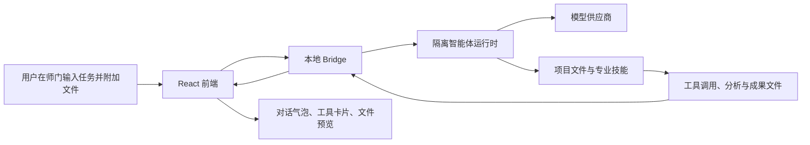

# 师门 ShiMen（The Mentorship Guild）
# 产品报告写作底稿与完整介绍

> 当前产品版本：`1.0.0`
>
> 建议用法：正式文稿可以直接引用“可直接使用的产品表述”章节；需要写长篇报告时，可按“推荐报告结构”章节组织内容；涉及技术能力时，以“已实现能力”和“边界说明”为准。

---

## 目录

1. [一句话说明](#一句话说明)
2. [执行摘要](#执行摘要)
3. [产品诞生背景与问题](#产品诞生背景与问题)
4. [产品定位与非定位](#产品定位与非定位)
5. [核心概念与术语](#核心概念与术语)
6. [目标用户与典型场景](#目标用户与典型场景)
7. [用户旅程与完整使用流程](#用户旅程与完整使用流程)
8. [功能全景](#功能全景)
9. [核心模块详细说明](#核心模块详细说明)
10. [多智能体协作机制](#多智能体协作机制)
11. [技能、工具与依赖管理](#技能工具与依赖管理)
12. [成果文件与可视化交付](#成果文件与可视化交付)
13. [技术架构与数据流](#技术架构与数据流)
14. [本地数据、隔离与安全](#本地数据隔离与安全)
15. [部署、运行与迁移](#部署运行与迁移)
16. [界面与交互特征](#界面与交互特征)
17. [可靠性与可追溯性设计](#可靠性与可追溯性设计)
18. [当前能力边界](#当前能力边界)
19. [产品价值与差异化](#产品价值与差异化)
20. [推荐报告结构](#推荐报告结构)
21. [可直接使用的产品表述](#可直接使用的产品表述)
22. [常见问答](#常见问答)
23. [写作禁区与措辞校准](#写作禁区与措辞校准)

---

## 一句话说明

师门 ShiMen（The Mentorship Guild）是一套面向 Windows 本地工作场景的智能体工作台。它以真实项目文件夹为工作边界，将连续会话、角色分工、模型供应商、专业技能、隔离运行环境和成果文件管理整合到同一个桌面应用中，帮助用户把一次次 AI 对话沉淀为可追溯、可复用、可交付的工作流程。

## 执行摘要

在研究、开发、数据分析和内容生产中，用户往往同时面对项目文件分散、上下文难以延续、模型配置复杂、生成结果难以复用、不同专业任务缺少清晰分工等问题。普通聊天工具能够给出回答，却很难稳定承载一个持续数天或数周推进的实际项目。

师门的设计目标，是为这类工作提供一个本地优先的智能协作空间。用户可以把一个真实本地文件夹登记为项目，在项目内建立会话、上传或引用文件、选择模型和推理强度、调用具有明确职责的智能体，并在同一界面中查看过程活动、工具调用、文件产物和最终结论。

产品将“对话”扩展为可管理的工作单元：

- 对话不再脱离文件与目录，而是归属到具体项目。
- 智能体不再只有单一身份，而是可以按职责、表达风格、行为约束和技能范围承担不同工作。
- 生成结果不只是一段文本，可沉淀为可预览、可打开、可下载的文档、表格、图像、流程图和报告。
- 模型、技能、会话、认证和依赖尽量保存在项目或应用的隔离范围内，降低误用全局环境的风险。
- 当任务确实需要额外的 Python 或 R 依赖时，智能体可以在受控的本地目录中自动安装并验证，而不是要求用户手工维护复杂环境。

师门适合作为研究辅助、软件开发辅助、数据分析协作、科研图表制作、知识整理、报告写作和多文件任务处理的本地工作台。它不替代专业人员，也不提供模型账号或第三方服务保证；它的价值在于让用户更系统地组织、执行和复用智能体辅助工作。

## 产品诞生背景与问题

### 1. 传统 AI 问答的局限

大量 AI 工具以临时聊天窗口为中心，用户提出问题、得到回答，然后手动复制到文档或项目中。这种模式在简单问答中足够高效，但在需要持续推进的工作中常会暴露以下问题：

| 常见问题 | 对实际工作的影响 |
| --- | --- |
| 上下文分散 | 研究背景、文件路径、既有结论和修改记录散落在多个窗口中，难以延续。 |
| 项目边界不清 | 不同客户、课题或代码仓库的材料混在一起，容易误引用或误操作。 |
| 模型配置门槛高 | API Key、Base URL、模型目录、默认模型和推理参数通常需要手工维护。 |
| 角色分工缺失 | 研究、分析、绘图、写作等任务由同一个泛化助手处理，职责与输出标准不稳定。 |
| 工具过程不可见 | 用户难以判断智能体是否实际读取了文件、调用了命令或生成了成果。 |
| 文件交付断裂 | 生成的 PDF、Word、表格、图像和代码往往只以路径或文本出现，难以直接查看和复用。 |
| 环境维护困难 | 缺少 Python、R 或专业库时，用户需要自己处理版本、安装位置和系统污染问题。 |

### 2. 师门的回应方式

师门并不把自身定义为“另一个聊天窗口”，而是将 AI 能力嵌入项目型工作过程。它将工作过程拆成可管理的对象：项目、会话、角色、技能、模型供应商、文件产物和运行环境。用户可以看见它们之间的关系，也可以在后续工作中继续沿用这些关系。

### 3. 产品设计原则

| 原则 | 含义 |
| --- | --- |
| 本地优先 | 项目、会话、名册、配置、技能索引和运行状态优先存放于本地。 |
| 项目为界 | 智能体任务围绕用户选择的真实文件夹展开，而不是在无边界的临时空间中运行。 |
| 角色可见 | 不同智能体的职责、表达方式、技能范围和交接关系可被配置和查看。 |
| 过程可追溯 | 尽可能保留用户问题、工具调用、阶段性结果、产物路径和最终结论。 |
| 成果可交付 | 将文档、图表、表格和图像作为可操作对象呈现，而非仅显示路径。 |
| 环境隔离 | 尽量避免读取或污染用户系统级智能体配置、Python 包和 R 包目录。 |
| 不夸大能力 | 模型输出、外部服务可用性与专业结论均受条件限制，产品应明确这些边界。 |

## 产品定位与非定位

### 产品定位

师门定位为“本地项目型智能体工作台”。它处于以下几类工具之间：

- 在用户体验上，它提供接近桌面聊天应用的会话入口。
- 在工作组织上，它具备项目、文件、角色和成果管理能力。
- 在执行能力上，它可以驱动隔离的智能体运行时、模型供应商和专业技能。
- 在交付方式上，它将生成内容转化为文件、图表、报告和可追溯记录。

因此，师门不是单纯的模型聚合器，也不是单一领域的分析软件，而是一个可承载不同专业任务的本地协作底座。

### 非定位

以下内容不应被写成师门的产品承诺：

- 不应写成“自带大模型”或“免费提供模型额度”。模型调用依赖用户自己的供应商配置与 API Key。
- 不应写成“保证研究、医疗、法律、财务或工程结论正确”。智能体输出仍需要专业人员审核。
- 不应写成“完全不需要安装或配置”。新设备运行需要满足必要运行时条件，模型服务仍需用户配置。
- 不应写成“云端统一托管所有用户数据”。产品设计是本地优先，外部传输取决于用户选用的模型和服务。
- 不应写成“自动执行任何系统操作”。实际文件与系统操作应受项目范围、权限模式、工具能力和任务约束影响。

## 核心概念与术语

| 术语 | 面向非技术人员的解释 |
| --- | --- |
| 师门 | 产品名称，英文为 ShiMen（The Mentorship Guild）。 |
| 项目 | 用户登记的一个真实本地文件夹，是文件、会话和工作记录的主要边界。 |
| 会话 | 围绕一个问题或任务连续进行的对话和执行记录。 |
| 智能体 / Agent | 由模型驱动、能够依据角色设定和技能完成任务的工作角色。 |
| 名册 | 用于展示和维护智能体角色、职责、风格、约束与已激活技能的模块。 |
| 技能 / Skill | 以说明文件形式保存的专业工作规范或工具使用流程，例如文档处理、研究、绘图、数据分析。 |
| 供应商 | 提供模型接口的第三方服务配置单元，包含 API Key、Base URL、协议、模型列表和默认模型等信息。 |
| 模型 | 实际处理用户请求的语言或多模态模型。 |
| 推理强度 | 用户可选择的处理深度档位，用于平衡速度、成本和复杂任务的分析深度。 |
| Bridge | 本地桥接服务，负责把前端页面、隔离运行时、配置、会话和文件操作连接起来。 |
| CDXAgent | 应用目录中的隔离智能体运行目录，用于保存配置、会话、技能、认证和相关状态。 |
| 成果文件 | 智能体生成或引用的本地文件，如 Markdown、PDF、DOCX、PPTX、XLSX、SVG、PNG。 |
| 工具调用 | 智能体在处理任务中执行的文件读取、命令、网页、图像或其他工具活动。 |
| 工作包 / 交接包 | 多智能体协作时，为下一角色整理的目标、已知事实、输入、结果、限制和下一步要求。 |

## 目标用户与典型场景

### 1. 研究与学术写作人员

研究人员可为一个课题建立独立项目，将文献、数据文件、研究问题、分析过程和报告成果保留在同一工作空间。智能体可以协助研究问题拆解、文献整理、方法设计、统计分析、图表说明和报告初稿编写。

**典型任务示例：**“请基于项目中的论文、实验记录和数据表，梳理研究问题，形成文献综述提纲，并输出一份可继续修改的报告。”

### 2. 软件开发与测试人员

开发人员可将代码仓库登记为项目，围绕需求分析、缺陷定位、代码修复、测试设计、接口文档和流程图进行连续协作。通过会话和工具记录，可回看智能体是否检查了相关文件、执行了哪些命令以及生成了哪些产物。

**典型任务示例：**“分析当前项目的登录模块，定位导致会话失效的原因，给出修复建议、测试用例和变更说明。”

### 3. 数据分析与生物信息学使用者

对于具有统计、表达矩阵、单细胞数据、样本信息或结果文件的项目，师门可承接分析、可视化和报告制作过程。角色可以按“任务拆解、专业分析、图表制作、结果验收”分工协作，避免把分析、解释和呈现混为一体。

**典型任务示例：**“比较对照组与处理组的差异表达结果，输出结果表、统计结论、火山图、热图和 PDF 报告。”

### 4. 内容、咨询与知识型工作者

用户可以把调研材料、访谈记录、提纲、初稿、图表和演示材料组织在一个项目中，用智能体完成结构梳理、内容改写、资料汇总、演示稿框架和交付文件生成。

**典型任务示例：**“根据项目内的访谈纪要和竞品资料，形成产品调研报告、汇报提纲和一份管理层摘要。”

### 5. 需要迁移部署的个人或小团队

师门提供便携版与安装版交付形态，适合在新电脑、实验室设备、离线办公电脑或受控内网设备上部署。模型服务与数据来源仍由使用者自行管理。

## 用户旅程与完整使用流程

### 阶段一：安装与首次进入

1. 用户运行安装版或便携版程序。
2. 应用检查本地运行条件，并启动本地 Bridge 与前端页面。
3. 首次使用时，用户填写自己的显示名称与师门名称；未填写时使用产品预设的兜底名称。
4. 系统在首次安装且尚无配置时展示新手引导；后续进入不会反复打断正常工作。

### 阶段二：配置模型供应商

1. 用户进入“管理”页面并打开供应商模块。
2. 用户选择供应商卡片，例如产品引导中推荐的 LinkBus。
3. 用户按照平台规则注册、创建令牌并复制 API Key。
4. 用户填写 API Key，获取该供应商返回的模型列表。
5. 用户删除不需要的模型，选择默认模型并保存配置。
6. 配置写入隔离运行目录，而不是直接覆盖用户系统级配置。

### 阶段三：建立项目

1. 用户在项目管理中点击添加项目。
2. 用户通过系统文件夹选择器定位真实工作目录。
3. 系统保存规范化目录路径，例如 `E:\\test`，而不是带多余尾部分隔符或文件后缀的路径。
4. 用户进入项目后，可以看到属于该目录的会话和工作内容。

### 阶段四：发起任务

1. 用户在对话页选择当前智能体。
2. 用户在输入工具栏选择模型与推理强度，或使用产品提供的默认选择。
3. 用户输入问题并按需附加项目中的文件。
4. 智能体收到任务后，结合当前角色设定、已激活技能和项目上下文判断处理方式。

### 阶段五：执行与协作

1. 对简单任务，当前智能体可直接回答，不必制造额外流程。
2. 对专业任务，当前智能体可先读取相关技能规范、检查输入文件、调用工具并形成阶段性成果。
3. 当需要其他角色参与时，可将任务目标、输入、已知事实、限制条件和期望交付整理成工作包后转交。
4. 前端持续显示处理状态、思考与工具活动，避免用户只看到长时间空白等待。
5. 对需要额外依赖的安全可重试任务，智能体可先补齐隔离环境中的 Python 或 R 包，再继续执行。

### 阶段六：查看与交付成果

1. 智能体的最终回复会说明结论、方法、限制和生成文件。
2. 识别到的成果文件会在对话中显示为文件卡片。
3. 用户可以预览、打开或下载支持的文件。
4. 用户可以继续在同一会话追问、补充文件、要求修改，或导出会话 Markdown 作为工作记录。

## 功能全景

| 功能域 | 已实现的主要能力 | 用户获得的价值 |
| --- | --- | --- |
| 首页与对话 | 项目内会话、流式回复、模型与推理强度选择、文件输入、状态展示 | 将问题、过程和成果放在同一工作入口。 |
| 项目管理 | 添加本地文件夹、项目元数据、会话关联、项目级设置 | 将 AI 工作与真实目录绑定。 |
| 名册与角色 | 角色定位、职责、风格、约束、已激活技能、顶栏切换 | 让不同工作角色有明确边界。 |
| 供应商管理 | 供应商卡片、API 引导、模型获取、模型精简、默认模型保存 | 降低 API 和模型配置难度。 |
| 技能管理 | 导入技能、中文用途说明、授权清单、按需读取规范 | 将专业工作流程沉淀为可复用能力。 |
| 工具可观测性 | 工具调用卡片、命令摘要、执行状态、过程记录保存 | 用户能够理解智能体是否真正执行了工作。 |
| 文件成果 | 文件识别、预览、系统打开、下载、图表和导图渲染 | 将回答转为可继续使用的交付物。 |
| 环境管理 | 隔离运行时、Python、R、Node 检测和本地依赖补齐 | 减少复杂任务对用户手工配环境的依赖。 |
| 引导与帮助 | 首次配置引导、管理页重新查看入口、供应商获取说明 | 帮助新用户完成从安装到首次可用的路径。 |
| 部署与维护 | 便携版、安装版、桌面快捷方式、卸载入口 | 适配不同电脑和使用方式。 |

## 核心模块详细说明

### 一、对话工作区

对话工作区是用户最常使用的页面。它不是孤立的聊天框，而是项目任务的执行面板。

**页面主要组成：**

- 顶栏：展示师门名称和角色入口，可用于切换当前智能体并快速开始对应会话。
- 会话侧栏：用于浏览、切换、重命名和管理项目内会话。
- 消息区：使用气泡区分用户输入和智能体输出，避免多轮内容混淆。
- 思考与工具区：把过程性内容收纳在可展开区域，避免将每一段过程拆成大量消息气泡。
- 输入工具栏：支持输入文本、选择模型、选择推理强度、附加文件并发送任务。
- 成果卡片：对生成的文件提供预览、打开和下载操作。
- 底部状态栏：显示项目数量和当前版本 `1.0.0`。

**写作建议：**可把该模块描述为“将会话、执行过程与文件交付结合的任务工作区”，而不是简单写成“聊天页面”。

### 二、项目管理

项目管理把本地目录转换为可持续使用的工作边界。用户可以选择已有文件夹，不需要复制或改造原有项目结构。添加后，系统记录目录路径、项目元信息与关联会话，并在后续对话中以该目录作为工作上下文。

**适合强调的价值：**

- 让不同课题、代码仓库、客户项目或资料目录保持隔离。
- 让生成文件回到用户原有工作目录，而不是散落在临时下载目录。
- 让会话和项目关系更清晰，便于复盘和迁移。

### 三、供应商与模型管理

供应商模块面向需要自行接入模型服务的用户。它以卡片和标签式结构展示不同供应商，用户点击某个供应商后即可在同一详情区域查看和维护该供应商的 API Key、Base URL、模型列表、默认模型与推理设置。

**模块支持的关键动作：**

- 根据供应商模板建立配置索引。
- 显示 API 获取引导链接和面向新手的令牌创建说明。
- 从上游获取可用模型并填充模型候选列表。
- 删除不需要的模型，避免模型选择列表过长。
- 保存后将配置写入隔离环境中的 `config.toml`。

**写作注意：**不要承诺某个供应商一定可用、价格固定或提供特定模型。供应商能力由第三方平台决定，产品提供的是配置与调用管理能力。

### 四、名册与角色设定

名册模块用于定义智能体“以什么身份工作”。每个角色可以包含名称、角色定位、职责说明、表达风格、行为约束和已激活技能。角色设定会进入任务提示上下文，从而影响智能体实际输出，而不是仅作为页面上的展示信息。

为了保持普通用户环境稳定，用户模式下不暴露任意新增、删除或编辑角色的入口；开发维护层仍保留相应接口，便于产品迭代和专业角色配置。

名册页面对技能采用“最多展示已激活的前八项，更多技能通过展开弹窗查看”的方式，避免角色卡片因技能数量过多而失去可读性。

### 五、技能系统

技能是对特定任务流程的结构化说明。它可以告诉智能体何时使用、应读取哪些资料、应采用怎样的方法、应生成何种输出以及需要注意哪些限制。

师门不是在每一轮任务中扫描全部技能正文，而是先向当前角色提供“技能清单”，其中包含技能名称、中文用途和规范文件路径。智能体仅在任务与某项技能直接相关时读取相应 `SKILL.md`，从而降低无关读取、减少延迟并提高调用针对性。

技能可覆盖但不限于：

- 学术研究与文献综述。
- 数据分析、质量控制、统计建模和可视化。
- 生物信息学流程与科研报告。
- Markdown、DOCX、PDF、PPTX、XLSX 等文档处理。
- 图像生成、图片编辑、流程图和思维导图。
- 代码阅读、问题定位、修复、测试和开发文档。
- 网页检索、资料获取和动态页面操作。

### 六、工具调用与过程可视化

当智能体需要读取文件、执行命令、调用网页、生成图像或处理文档时，师门将相关活动显示为工具调用卡片。用户可以看到工具的类型、执行状态、部分输入与结果摘要。

界面会对内部脚手架信息进行过滤，尽量避免将无意义的底层调用名称直接暴露给用户。对于命令数量较多的情况，默认只展示有限数量的条目，更多内容可展开查看，以保持侧栏和消息区可读。

这项设计的意义在于：用户能够区分“智能体正在思考”“智能体确实执行了文件或命令操作”“智能体已经完成并生成成果”三种状态。

### 七、成果文件与预览

师门会解析会话文本中出现的支持类型文件路径，并将其转换为显眼的文件卡片。用户可以根据文件类型进行预览、调用系统默认程序打开或下载。

当前工作流重点覆盖以下成果：

| 类型 | 典型用途 |
| --- | --- |
| Markdown | 报告初稿、研究笔记、说明文档、会话导出。 |
| DOCX | 可编辑正式文档、方案、报告、材料初稿。 |
| PDF | 固定版式报告、分析结果、可打印交付。 |
| PPTX | 汇报材料、演示文稿、答辩或会议资料。 |
| XLSX / CSV | 分析结果表、数据摘要、样本信息、统计结果。 |
| SVG | 流程图、思维导图、结构示意图、可编辑矢量图。 |
| PNG 等图像 | 数据图表、图片成果、可直接插入报告的视觉材料。 |

对于 Mermaid 格式流程图，前端可将文本定义渲染为图形，而不是将其仅作为代码块展示。对于对话导图，系统可生成相应的图形文件并以成果卡片呈现。

### 八、环境检查与自动依赖补齐

复杂任务常依赖 Python、R、Node.js 以及特定第三方库。师门在启动与管理界面中检查关键运行环境，并在部署过程中为新电脑提供相应运行时的安装引导。

当智能体明确遇到必要的 Python 模块缺失或 R 包缺失时，产品提供受控安装机制：

1. 智能体先判断该依赖是否是完成当前任务的必要条件。
2. Python 依赖优先安装到应用的 `.venv`；若便携环境没有完整虚拟环境，则安装到项目本地 `.lmentor/python-packages`。
3. Python 安装器依次尝试阿里云、清华和中科大 PyPI 镜像。
4. R 包安装到项目 `.Rlib`。
5. 安装器验证模块或包可用后，智能体继续执行可安全重试的工作步骤。

这一机制的关键不是“自动安装任何东西”，而是“在受控目录中自动补齐完成任务所需的已校验依赖”。包名不能携带 URL、路径、任意命令参数或脚本片段，避免把不受控内容直接引入运行环境。

### 九、中文文稿编码保护

在 Windows 环境中，PowerShell 的默认写入方式可能因编码配置不同而导致中文字符变成问号。针对文章、报告、Markdown、HTML、SVG 和脚本等含中文文件，师门提供统一的 UTF-8 无 BOM 写入器。

写入器会创建目标目录、以 UTF-8 无 BOM 写入完整内容，并立即回读校验写入结果。智能体规则要求生成中文文章时使用该写入器，而不是使用 `Set-Content`、`Out-File` 或默认重定向方式。系统同时为 Python 子进程设置 UTF-8 运行环境，以减少跨工具编码不一致的问题。

## 多智能体协作机制

### 1. 协作的基本思想

师门支持多角色协作，但不采用机械的固定流水线。产品希望达到的效果是：由最合适的角色在最合适的阶段处理最合适的工作，而不是无论任务内容如何都强行经过多个角色。

### 2. 工作包内容

当需要交接时，工作包通常应包含以下信息：

- 原始任务目标与用户期望交付物。
- 已知输入文件、项目路径、数据结构和前提条件。
- 已完成工作、已有结果和可复用文件。
- 方法选择、关键参数与判断依据。
- 当前限制、未决问题和不应过度解读的结论。
- 下一角色需要完成的具体动作和输出格式。

### 3. 典型协作范式

**范式 A：单角色直接完成**

适用于解释概念、写短文、简单整理、轻量代码阅读等任务。当前角色完成后直接交付，不引入无必要的交接和复审。

**范式 B：任务拆解后专业处理**

适用于需要文件解析、统计分析、复杂研究或专业技能的任务。引导角色先明确目标和输入，再交由对应专业角色完成核心分析。

**范式 C：分析与呈现分离**

适用于数据分析、科研报告和图表交付。分析角色完成统计、结果表和限制说明后，将结构化结果与绘图要求交给可视化角色制作 SVG、PNG、PDF 或演示图件。

**范式 D：结果验收与迭代**

适用于高要求交付。负责角色根据原始目标、结果包、文件完整性和限制条件评估是否合格；不合格时要求补充分析、重新制作图件或调整报告。

### 4. 写作建议

在产品报告中，可将多智能体协作描述为“基于任务边界、角色职责和技能授权的动态分工机制”。不要写成“自动保证所有任务由最佳专家完成”，因为实际效果仍取决于模型能力、角色配置、输入资料和可用技能。

## 技能、工具与依赖管理

### 技能选择逻辑

当前角色接收任务时，系统向模型暴露该角色的已激活技能索引。索引包含技能名称、中文用途和规范文件位置。模型根据用户需求判断是否需要技能：

1. 若任务简单且不需要工具，直接回答。
2. 若任务需要专业流程，先从清单定位最相关的一至三项技能。
3. 仅读取确认直接相关的规范文件。
4. 按规范执行工具、分析或文件产出流程。
5. 若已激活技能均不适用，再基于通用模型能力完成任务。

该逻辑避免“每次对话都读取一百多个技能”的低效行为，也避免为了显示技能调用而使用无关工具。

### 工具使用原则

- 文件读取应优先使用 UTF-8 安全方式，尤其是含中文的技能说明和参考文件。
- 文本写入应使用统一 UTF-8 无 BOM 写入器。
- 工具活动应围绕当前项目和用户任务，不应无目的扫描目录或批量读取无关文件。
- 失败后是否重试应区分操作性质：只读或安全可重复步骤可自动重试；会造成外部副作用的操作不应被盲目重复。
- 工具调用记录应尽可能保留语义化名称和摘要，而非只显示底层运行时信息。

## 成果文件与可视化交付

### 1. 为什么强调文件交付

对用户而言，真正有价值的不是“模型说它完成了”，而是得到可以继续编辑、查看、打印、转发或归档的成果。师门将文件产物放回对话工作流，减少用户在文件系统、聊天记录和办公软件之间来回切换。

### 2. 典型交付链路

以科研分析为例，智能体可输出：

1. 输入数据检查说明。
2. 可复现分析脚本。
3. 结果表和统计摘要。
4. 火山图、热图、PCA 图或其他可视化图件。
5. Markdown、HTML、PDF 或 DOCX 格式报告。
6. 文件路径、方法限制和后续建议。

前端随后将这些文件路径识别为成果卡片，让用户直接预览或打开。该逻辑同样适用于软件测试流程图、产品方案、思维导图、演示文稿和文档草稿。

### 3. 图形输出

师门支持以 Mermaid 渲染流程图，也可将对话内容和任务结构整理为 SVG 等可视化成果。对于图像与图表工作，产品强调“生成真实图形文件并在界面中呈现”，而不是只输出一段 Markdown 描述。

## 技术架构与数据流

### 1. 总体架构

师门采用本地桌面应用架构，核心组成包括：

| 层级 | 主要职责 |
| --- | --- |
| 前端界面 | 使用 React 与 TypeScript 构建，负责项目、会话、供应商、名册、引导、文件预览和过程展示。 |
| 本地 Bridge | 使用 Node.js 实现，负责前端命令调用、会话读取、项目扫描、配置管理、智能体运行、工具轨迹与文件操作。 |
| 启动器 | 使用 Python 管理 Bridge、前端、本地端口、运行时环境、日志和健康检查。 |
| 隔离智能体运行时 | 以应用内 `CDXAgent` 目录承载模型运行配置、认证、会话、技能和状态。 |
| 本地运行依赖 | 包含或检测 Python、R、Node.js，以及项目级 Python 包与 R 包目录。 |
| 打包与安装层 | 负责便携版、安装版、图标、桌面快捷方式和卸载入口。 |

### 2. 典型数据流

### 3. 会话执行过程

1. 前端向 Bridge 发送项目路径、会话标识、角色标识、用户文本和附件路径。
2. Bridge 读取当前名册、角色授权技能、项目权限和隔离配置。
3. Bridge 组合角色提示、技能索引、记忆与用户请求，启动隔离智能体运行时。
4. 运行时以流式事件返回会话创建、文本、工具开始、工具结果、完成或失败状态。
5. Bridge 将事件转为前端可识别的结构，并保存必要的会话与工具轨迹。
6. 前端实时更新消息、过程卡片和成果文件入口。

### 4. 配置与状态位置

以下是产品报告中可概括说明的本地结构，不需要向普通读者展开全部技术细节：

| 路径或范围 | 作用 |
| --- | --- |
| `CDXAgent/` | 隔离智能体运行目录，保存配置、认证、会话、技能和状态。 |
| `CDXAgent/config.toml` | 模型供应商、模型与相关运行配置。 |
| `CDXAgent/skills/` | 已安装或已同步的专业技能。 |
| `.venv/` | 应用优先使用的 Python 虚拟环境。 |
| `.lmentor/python-packages/` | 便携环境回退到主机 Python 时的项目级 Python 包目录。 |
| `.Rlib/` | 项目级 R 包目录。 |
| 项目文件夹 | 用户真实工作资料与智能体生成的项目成果。 |
| `logs/` | 启动、健康检查和运行日志。 |

## 本地数据、隔离与安全

### 本地优先原则

师门优先将运行状态保存在应用或项目范围内。对于用户而言，这意味着项目资料、会话线索、名册配置和文件产物不会因为切换浏览器标签或网页会话而天然丢失。对于部署人员而言，这也意味着迁移时应考虑应用目录和用户项目目录两部分。

### 隔离运行时

产品通过项目内 `CDXAgent` 目录隔离智能体配置与会话状态，避免默认读取用户主目录下的同类运行时配置。该设计尤其适合演示环境、教学环境、便携部署和需要与既有个人环境分开的场景。

### API Key 与外部服务

师门提供 API Key 的配置和使用入口，但不生成、不托管也不保证第三方密钥。用户必须自行从供应商平台获取合法密钥，理解相关费用、限额、数据政策和服务条款。正式产品报告应明确：外部模型服务由相应供应商提供，师门负责本地配置和工作流组织。

### 权限与文件操作

智能体处理本地文件的范围与项目目录、当前权限模式和具体任务有关。对于写入、覆盖、删除、提交或其他可能产生副作用的操作，应遵循清晰任务依据与结果记录原则。产品不应被宣传为无条件自动操作系统的工具。

## 部署、运行与迁移

### 1. 便携版

便携版适合快速试用、移动存储、实验室设备或无法进行复杂安装的场景。用户解压后即可从应用目录启动。便携版仍需要在目标电脑上满足必要运行条件，或通过随附安装流程补齐相关组件。

### 2. 安装版

安装版提供更面向普通用户的引导：选择安装目录、检测并安装必要运行时、创建桌面快捷方式，以及通过卸载程序清理安装目录。安装目录采用英文路径约定，以降低工具链和运行时对非 ASCII 路径的兼容风险。

### 3. 新电脑部署说明

在新电脑上部署时，建议按以下顺序检查：

1. 操作系统满足 Windows 10 或 Windows 11 使用条件。
2. 安装程序完成 Python、R、Node.js 等必要运行时检查与安装。
3. 应用能启动 Bridge 和前端页面，并显示本地运行环境状态。
4. 用户配置自己的模型供应商与 API Key。
5. 用户添加自己的项目目录或从备份中迁移项目资料。
6. 用户用一个简单任务验证会话、工具、文件输出和成果预览。

### 4. 数据迁移建议

迁移时应区分“程序运行环境”和“用户工作数据”：

- 程序运行环境包括应用目录、隔离运行时、已安装技能和项目级依赖。
- 用户工作数据包括项目文件夹、会话资料、个人供应商配置和 API Key。
- API Key 属于敏感信息，应按单位或个人安全要求单独迁移和核验。
- 若只迁移应用而不迁移项目目录，历史会话中引用的原始文件路径可能无法在新电脑上直接打开。

## 界面与交互特征

### 1. 视觉组织

师门采用以工作效率为中心的桌面界面。顶栏承担角色与管理入口，侧栏承担项目和会话导航，中央区域承担任务对话与文件交付，管理页承担供应商、名册、项目和环境设置。界面避免将所有能力堆叠在首页，而是围绕“开始工作、管理配置、查看结果”三类高频动作组织。

### 2. 对话信息层级

为了让长任务可读，消息区在视觉上区分：

- 用户输入：表示需求、文件和补充指令。
- 智能体正式输出：表示回答、结论、阶段成果和交付说明。
- 思考与规划：表示执行前的判断、方法和过程性说明，可收纳展开。
- 工具调用：表示命令、文件读取、图像、网页或其他实际操作。
- 文件成果：表示可点击、可预览和可下载的交付物。

### 3. 新手引导

首次安装且未完成基础配置时，产品提供聚焦式引导，带领用户从首页进入管理页、选择供应商、获取 API、填写密钥、拉取模型、精简模型并保存配置。用户也可以在管理页主动重新查看引导。引导不会在每次进入首页时重复弹出，避免影响熟练用户。

## 可靠性与可追溯性设计

### 1. 过程记录

师门保留会话消息和工具活动轨迹，目的不是展示复杂技术细节，而是让用户能够判断任务经历了哪些主要步骤、使用了哪些工具、是否真正生成了成果。

### 2. 运行状态与健康检查

启动器会检查 Bridge、前端与隔离运行时状态，并在控制台和概况模块中呈现必要信息。对于启动阶段的短暂超时或服务重启，系统需要保持重试和状态恢复能力，避免因为一次短暂请求阻塞造成会话和项目表面上“消失”。

### 3. 编码稳定性

中文文稿写入采用 UTF-8 无 BOM 方案，并通过回读校验确保写入值与原始内容一致。产品报告可将这一能力描述为“针对 Windows 文本编码差异的输出稳定性措施”。

### 4. 依赖稳定性

自动依赖补齐仅处理明确缺失且当前任务必需的依赖，并使用项目级安装目录。这样可以减少用户因单个任务手动安装环境的负担，也避免将大量包无差别写入系统全局环境。

## 当前能力边界

为避免产品报告过度承诺，建议保留以下边界说明：

1. 模型输出质量受所选模型、提示、文件质量、技能规则和外部服务状态影响。
2. 第三方供应商的模型、费用、速率限制、可用性和数据政策不由师门控制。
3. 对于医学、法律、财务、安全、生物实验和其他高风险领域，智能体输出只能作为辅助材料，必须由具备资质的专业人员复核。
4. 数据分析结果依赖输入数据质量、样本设计、统计方法和环境依赖，不能仅凭自动生成文本得出确定性科研结论。
5. 文件自动生成不代表文件内容已经通过业务、合规、排版或事实审查。
6. 自动依赖安装受网络、镜像、操作系统、Python/R 版本和包兼容性影响，失败时仍可能需要人工处理。
7. 本地优先不等于完全离线；只要调用远程模型或网页服务，相关请求仍会与外部服务发生通信。

## 产品价值与差异化

### 1. 从单轮回答转向连续工作

师门的核心差异不是“回答更多问题”，而是为真实项目保留连续性。一个项目中的问题、附件、分析、图表和交付文件可以沿会话逐步积累，减少每次重新解释背景的成本。

### 2. 从单一助手转向职责协作

通过名册、角色约束和技能授权，用户可以让不同智能体承担不同阶段的工作。这样既有利于输出风格稳定，也有利于将复杂任务拆成可检查的步骤。

### 3. 从文本输出转向成果交付

师门将文件视为一等对象。报告、表格、SVG、PDF、Word、演示稿和图像可以直接在对话中出现并被操作，使 AI 的价值更接近实际交付。

### 4. 从全局环境依赖转向项目级隔离

隔离的运行时、技能目录、Python 包目录和 R 库目录，降低了不同项目或不同电脑之间互相影响的可能性。这对需要迁移、演示、教学、受控部署或多任务并行的用户尤其重要。

### 5. 从黑箱等待转向可观察过程

工具调用、思考状态、任务进度和成果文件提供了必要的过程可见性。用户不必只依靠最终一句“已完成”判断任务是否真的执行。

## 推荐报告结构

若需要撰写正式的产品介绍、项目总结或立项材料，可采用以下结构：

### 结构 A：面向管理层的产品介绍

1. 背景与痛点：说明知识型工作中上下文分散、文件交付断裂和配置复杂的问题。
2. 产品定位：说明师门是本地项目型智能体工作台。
3. 核心价值：项目边界、连续会话、角色协作、文件交付、环境隔离。
4. 典型场景：研究、开发、数据分析、报告写作。
5. 部署与安全：本地优先、隔离目录、供应商由用户配置。
6. 边界与风险：模型与第三方服务不作保证，专业结果需要审核。

### 结构 B：面向技术或交付团队的实施说明

1. 系统组成：React 前端、Node Bridge、Python 启动器、隔离运行时、项目文件夹。
2. 核心数据流：前端请求、Bridge 调度、智能体运行、工具事件、文件卡片回传。
3. 配置管理：供应商配置、角色配置、技能索引、项目元信息。
4. 环境策略：`.venv`、`.Rlib`、项目级 Python 包目录、受控镜像安装。
5. 打包与部署：便携版、安装版、运行时检测、日志与排障。
6. 验收要点：启动、配置、项目选择、会话、工具显示、文件预览和中文写入。

### 结构 C：面向用户培训的使用说明

1. 安装与首次身份设置。
2. 配置供应商和 API Key。
3. 添加项目目录。
4. 选择智能体、模型与推理强度。
5. 发起任务、查看工具过程。
6. 打开、下载和继续修改成果文件。
7. 遇到环境缺包、启动失败或模型失败时的检查路径。

## 可直接使用的产品表述

### 1. 50 字简介

师门是一套面向 Windows 本地工作场景的智能体工作台，以真实项目目录为边界，整合会话、角色、技能、模型配置和成果文件交付。

### 2. 100 字简介

师门 ShiMen（The Mentorship Guild）是一套本地优先的智能体工作台。用户可围绕真实项目文件夹开展连续对话、文件处理、研究分析、报告写作和图表制作，并通过角色分工、技能调用、供应商配置、过程记录和成果预览，将零散 AI 对话沉淀为可追溯、可复用的工作流程。

### 3. 300 字产品介绍

师门 ShiMen（The Mentorship Guild）面向 Windows 本地工作场景，提供以项目为中心的智能体协作能力。用户可以将真实文件夹登记为项目，在项目内建立连续会话、附加文件、选择模型与推理强度，并让具有明确职责、表达风格和技能范围的智能体完成研究、开发、数据分析、写作、绘图和文档交付等任务。产品通过本地 Bridge 连接前端界面、隔离运行时、模型供应商、技能目录和项目文件；处理过程中可展示工具调用、阶段结果和最终成果。对 Markdown、Word、PDF、表格、SVG、PNG 等文件，师门提供预览、打开和下载入口，使模型输出能够转化为可继续编辑和归档的交付物。师门采用本地优先与运行时隔离设计，模型 API 和第三方服务由用户自行配置，产品不替代专业判断，但可帮助用户更系统地组织、执行和复用智能体辅助工作。

### 4. 面向研究场景的表述

师门为研究与分析工作提供项目化智能协作空间。研究人员可以围绕课题目录持续保存问题、资料、数据、分析过程、图表和报告，通过专业技能与角色分工辅助完成文献整理、研究设计、数据处理、科研可视化和成果交付。系统保留方法、文件和限制说明，便于后续复核与迭代。

### 5. 面向开发场景的表述

师门将智能体能力嵌入真实代码项目。开发人员可围绕代码仓库进行需求澄清、文件阅读、问题定位、代码修复、测试设计、流程图制作和技术文档输出，并在会话中查看工具过程和生成文件。项目边界和会话记录有助于减少不同任务的上下文混杂。

### 6. 面向数据分析场景的表述

师门支持从数据文件解析、统计分析到图表和报告交付的连续工作链路。通过角色分工，分析任务可以在方法选择、结果表生成、可视化制作和成果验收之间有序交接；用户能够直接查看生成的结果表、图像、PDF 或其他文件，并保留分析限制与可追溯信息。

## 常见问答

### 师门和普通聊天工具有什么区别？

普通聊天工具以单轮或连续文本问答为中心。师门以真实项目为中心，将会话、文件、角色、技能、模型配置、工具过程和成果文件放在同一个本地工作空间中，更适合持续推进的任务。

### 师门是否自带模型？

师门提供模型供应商配置和调用管理能力，但不提供模型账号、API Key、调用额度或第三方服务保证。用户需要自行选择供应商并配置密钥。

### 师门是否需要联网？

应用本身可以在本地启动和管理项目，但若使用远程模型、网页检索、在线模型目录或自动下载依赖，则需要网络连接。是否向外部服务发送内容，取决于用户使用的供应商和任务类型。

### 师门能否处理本地文件？

可以。产品围绕用户添加的项目目录组织文件处理与成果输出。具体可操作范围受当前权限、智能体能力、任务内容和本地运行环境影响。

### 师门如何处理缺少 Python 或 R 包的问题？

当智能体明确发现完成当前任务所必需的依赖缺失时，可将 Python 包安装到应用虚拟环境或项目级包目录，将 R 包安装到项目 `.Rlib`，并在安装后验证可用性。该过程使用受控包名规则，不直接接受 URL 或任意命令。

### 师门是否保证自动安装一定成功？

不保证。安装结果还受到网络、镜像可用性、操作系统、运行时版本和第三方包兼容性的影响。产品提供的是减少手工环境维护的机制，而不是对所有依赖场景的绝对承诺。

### 师门能生成哪些成果？

根据任务、模型、技能和本地依赖情况，师门可组织生成 Markdown、DOCX、PDF、PPTX、XLSX、CSV、SVG、PNG 等文件，并在对话中提供相应操作入口。

### 师门中的角色是否只是名称不同？

不是。角色可携带职责、表达风格、行为约束和已激活技能，并被写入任务提示上下文，从而影响实际处理方式和输出边界。

### 为什么需要项目？

项目为文件、会话与任务提供边界。它能帮助用户避免不同工作混杂，也让生成的成果回到原有工作目录，便于归档和继续使用。

## 写作禁区与措辞校准

### 可以使用的措辞

- “支持”“提供”“可用于”“帮助用户”“在满足条件时可”。
- “本地优先”“项目级隔离”“可追溯的工作流程”。
- “依据任务、角色和技能进行动态分工”。
- “可将生成文件识别为可操作成果”。
- “对缺失的必要依赖提供受控的自动补齐机制”。

### 不建议使用的措辞

- “完全自动化”“零配置”“无条件可用”。
- “保证准确”“保证成功”“替代专家”。
- “永久记忆一切内容”“绝不丢失数据”。
- “所有文件均可解析”“所有格式均可完美渲染”。
- “自动完成所有系统修改”。
- “内置所有模型”“免费无限调用”。

### 推荐的边界句式

> 师门的实际效果取决于用户配置的模型服务、项目材料质量、已激活技能和本地运行环境；对于专业结论与高风险任务，仍应由相关领域人员复核。

> 师门重点解决的是智能体辅助工作中的项目组织、过程追踪、文件交付和环境隔离问题，而非替代第三方模型平台或专业决策流程。

---

## 附：报告撰写前的核对清单

- [ ] 是否使用了产品全称“师门 ShiMen（The Mentorship Guild）”。
- [ ] 是否将产品定位为本地项目型智能体工作台，而非单纯聊天工具。
- [ ] 是否说明模型服务由用户自行配置，而非师门自带。
- [ ] 是否提及项目、会话、角色、技能、供应商、文件成果和隔离环境这几个核心对象。
- [ ] 是否说明生成结果可作为文件交付，而不仅是文本回复。
- [ ] 是否避免承诺模型准确率、第三方服务可用性或专业结论正确性。
- [ ] 是否在技术章节中区分前端、Bridge、启动器、隔离运行时和项目文件。
- [ ] 是否在安全章节中说明本地优先、API Key 责任和外部服务边界。
- [ ] 是否在部署章节中区分便携版、安装版、运行时检查和用户数据迁移。
- [ ] 是否使用“支持”“可用于”“在满足条件时”而不是绝对化措辞。
